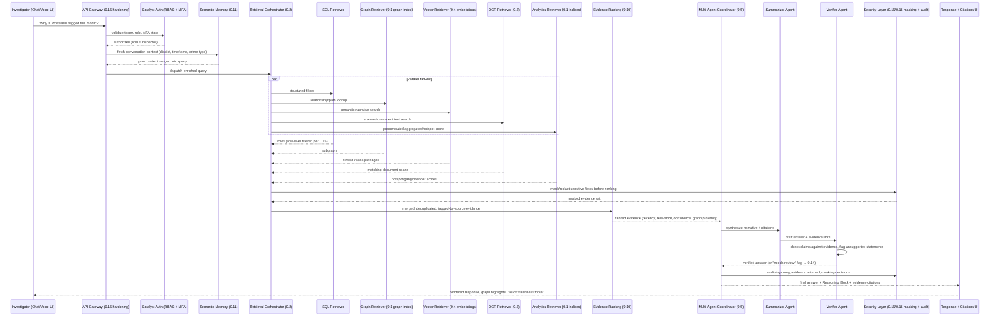

# CrimeIntel — 25-Phase Development Blueprint

> **AI Investigator Copilot for Karnataka State Police**
> A phased masterplan to build and evolve one of the most ambitious, production-grade crime intelligence platforms ever attempted at a hackathon — then scale it into a genuine operational tool.

---

## How This Document Works

| Phase Range | Purpose | Complexity |
|---|---|---|
| **Phase 0.0–0.18** | **INTELLIGENCE ARCHITECTURE** — The standing retrieval, reasoning, and governance substrate that Phases 1–25 are built on top of. Read this before Phase 1. | Each sub-phase is a dedicated subsystem (retrieval, agents, entity resolution, security, etc.) |
| **Phase 1–15** | **BUILD** — End-to-end construction from zero to a fully deployed, demo-ready platform | Each phase is a major engineering milestone with multiple deliverables |
| **Phase 16–25** | **UPGRADE** — Elevate from hackathon-grade to enterprise production-grade | Each phase transforms a subsystem into something battle-hardened and world-class |
| **Phase 26** | **PRESENT** — Package and pitch the finished platform for a judging session | A single closing chapter: deployment checklist, demo script, fallback plan, anticipated Q&A |

> [!IMPORTANT]
> Every phase is deliberately heavy. No phase is a "quick config change." Each phase involves architecture, implementation, testing, and visual polish. This is designed for building something genuinely exceptional.

---

# 🧠 PART 0 — The Crime Intelligence & Retrieval Architecture (Read Before Phase 1)

> [!IMPORTANT]
> This part does not replace or remove anything in Phases 1–25. It **inserts a missing architectural layer** underneath them. Where a phase already touches one of these topics (e.g. Phase 4 Chat, Phase 16 RAG, Phase 21 Agents), treat this section as the **authoritative deeper spec** for that subsystem — build it here, then wire the existing phase's deliverables on top of it.

### 0.0 — Why This Part Exists

The original roadmap effectively looked like:

```
Chat
  ↓
Reasoning
  ↓
Dashboard
```

This is too flat. A production-grade investigative platform needs a standing **intelligence substrate** that computes things *before* anyone asks, a **hybrid retrieval layer** that never relies on the LLM alone, and an **agentic, auditable, self-improving** loop around it. The revised core architecture:

```
                    ┌─────────────────────────────┐
                    │   Precomputation Engine      │  ← nightly + event-driven
                    │  (hotspots, scores, graph,   │
                    │   embeddings, summaries)     │
                    └──────────────┬──────────────┘
                                   ↓
                    ┌─────────────────────────────┐
                    │   Crime Intelligence Layer   │  ← always-on, sits on DB
                    └──────────────┬──────────────┘
                                   ↓
        ┌───────────────────────────────────────────────┐
        │                Hybrid Retrieval                │
        │   SQL + Graph + Vector + OCR Search + Analytics │
        └──────────────────────┬──────────────────────────┘
                                ↓
                    ┌─────────────────────────────┐
                    │      Evidence Ranking         │
                    └──────────────┬──────────────┘
                                   ↓
                    ┌─────────────────────────────┐
                    │   Multi-Agent Coordinator     │
                    │ SQL·OCR·Analytics·Graph·      │
                    │ Forecast Agents → Summarizer  │
                    │           → Verifier          │
                    └──────────────┬──────────────┘
                                   ↓
                    ┌─────────────────────────────┐
                    │      Chat / Dashboard UI      │  ← + Semantic Memory
                    └──────────────┬──────────────┘
                                   ↓
                    ┌─────────────────────────────┐
                    │  Human Feedback & Learning     │
                    └─────────────────────────────┘

   (Observability, Knowledge Versioning, Security-Beyond-RBAC, and
    Data & Application Security wrap around every box above.)
```

### 0.0.1 — One Query, Start to Finish (System Sequence Diagram)

Before diving into individual phases, here is what happens, in order, for a single investigator question. Every later phase either implements a step in this sequence or wraps around it (auth, audit, security).



Every box in the flat diagram above (0.0) is a stop on this line; every arrow into `SEC` is what Phase 0.15/0.16 verify never gets skipped.

This section is organized as **19 sub-phases (0.0 – 0.18)**, one per missing capability, in the same deliverable/exit-criteria format as the rest of the document.

---

## Phase 0.0: Database Foundation & Schema Mapping

### Objective
Every later phase — retrieval, graph, reasoning, sociological insights, security — assumes a specific schema shape. This chapter is the authoritative reference for that schema: what the given KSP Police FIR ER Diagram actually contains, how each table maps to which subsystem, which columns are sensitive, and what's missing from the schema as handed over. Phase 0.15's masking and Phase 0.16's field-level encryption both point back to the sensitivity table defined here — build this chapter first.

### Deliverables

#### 0.0.1 — Schema Inventory (as given)
The provided ER diagram defines 23 tables, grouped by domain:

| Domain | Tables |
|---|---|
| **Case Core** | `CaseMaster`, `ComplainantDetails`, `Victim`, `Accused`, `ArrestSurrender`, `ActSectionAssociation`, `ChargesheetDetails` |
| **Legal Classification** | `Act`, `Section`, `CrimeHead`, `CrimeSubHead`, `CrimeHeadActSection` |
| **Socio-Demographic Lookups** | `CasteMaster`, `ReligionMaster`, `OccupationMaster` |
| **Case Metadata Lookups** | `CaseCategory`, `GravityOffence`, `CaseStatusMaster` |
| **Org / Geo Structure** | `State`, `District`, `Unit`, `UnitType`, `Court` |
| **Personnel** | `Employee`, `Rank`, `Designation` |

`CaseMasterID` is the spine every other case-core table joins through. `CaseMaster.latitude`/`longitude` is the **only** point-level geo field in the entire schema — every other geo reference (arrests, courts, units, employees) is district/state-level only.

#### 0.0.2 — Sensitivity Classification (feeds Phase 0.15 masking + Phase 0.16 field-level encryption)

| Table.Column(s) | Classification | Why |
|---|---|---|
| `CasteMaster` linkage — `ComplainantDetails.CasteID` | **Highly Restricted** | Protected attribute; direct caste disclosure per individual |
| `ReligionMaster` linkage — `ComplainantDetails.ReligionID` | **Highly Restricted** | Protected attribute; direct religion disclosure per individual |
| `Victim.VictimName`, `Victim.AgeYear` where `AgeYear < 18` | **Highly Restricted** | Juvenile-victim identity |
| `Victim.*` in sexual-offense / POCSO-linked `CrimeSubHead` cases | **Highly Restricted** | Sensitive-crime victim identity (regardless of age) |
| `ComplainantDetails.ComplainantName`, `AgeYear`, `OccupationID` | **Restricted** | Direct PII of a complainant/potential informant |
| `Victim.VictimName`, `AgeYear`, `GenderID` (non-sensitive categories) | **Restricted** | Direct PII |
| `Accused.AccusedName`, `AgeYear`, `GenderID` | **Restricted** | Direct PII, presumption-of-innocence sensitivity pre-chargesheet |
| `ArrestSurrender.*` (dates, IO, court, accused link) | **Restricted** | Links a named person to a law-enforcement action |
| `CaseMaster.latitude`/`longitude`, `BriefFacts` | **Restricted** (Highly Restricted if linked case is a sensitive-crime category) | Precise location + free-text narrative can re-identify a victim's residence |
| `Employee.EmployeeDOB`, `KGID` | **Restricted** | Personnel PII |
| `ChargesheetDetails.cstype`, `csdate` | **Restricted** | Case-outcome ground truth; feeds profiling, sensitive if exposed pre-disposition |
| `CaseMaster.CrimeNo/CaseNo/CrimeRegisteredDate/CaseCategoryID/CaseStatusID`, `Employee.UnitID/RankID/DesignationID/DistrictID` | **Internal** | Operational data, not public, but not individually re-identifying on its own |
| `CasteMaster`, `ReligionMaster`, `OccupationMaster` (the lookup lists themselves) | **Internal** | The list of caste/religion names is not sensitive — the *linkage* of a specific person to a value is (see Highly Restricted rows above) |
| `Act`, `Section`, `CrimeHead`, `CrimeSubHead`, `CrimeHeadActSection`, `CaseCategory`, `GravityOffence`, `CaseStatusMaster`, `UnitType`, `Rank`, `Designation`, `District`, `State`, `Court`, `Unit` | **Public / Internal** | Legal and organizational reference data, no PII |

> [!IMPORTANT]
> This table **is** the "sensitivity table in the Database Foundation chapter" referenced by Phase 0.15 and Phase 0.16. Any new column added to the schema after this phase must be classified into one of these four tiers before it's wired into any retriever, dashboard, or export (per 0.16's exit criteria).

#### 0.0.3 — Schema → Subsystem Mapping
- **`CaseMaster`** is the spine — nearly every retrieval agent (SQL, Graph, Analytics) joins through `CaseMasterID`. Its `latitude`/`longitude` feed the hotspot/geospatial layer (Phase 0.1, Phase 7) directly — no extra geocoding needed.
- **`Accused` + `Victim` + `ComplainantDetails`**, joined via `CaseMasterID`, are the raw material for the Criminal Network Graph (Phase 5) and Entity Resolution (Phase 0.3). There is **no explicit accused-to-accused or accused-to-victim relationship table** beyond shared `CaseMasterID` — co-occurrence in the same case *is* the edge. This is a modeling decision every graph-building phase must account for, not an oversight to silently work around.
- **`ArrestSurrender` + `inv_arrestsurrenderaccused`** (junction referenced in the relationship matrix, not fully specified in the table definitions) is the one place a real many-to-many needs a junction table. See Known Schema Gaps (0.0.4) below.
- **`Act` / `Section` / `CrimeHead` / `CrimeSubHead` / `CrimeHeadActSection`** classification hierarchy feeds crime-type trend analytics and criminological-theory matching (Phase 6) — e.g., mapping IPC sections to reasoning theories.
- **`CasteMaster` / `ReligionMaster` / `OccupationMaster` / `GenderID`** on Complainant is the socio-demographic source for Phase 14 (Sociological Insights) — and simultaneously the most sensitive data in the schema (0.0.2), masked by default (0.15) and field-level encrypted (0.16), never table-access-gated alone.
- **`ChargesheetDetails.cstype`** (A/B/C: Chargesheet / False Case / Undetected) is the ground-truth label for offender profiling and "similar case outcome" features (Phase 8).
- **No latitude/longitude exists anywhere except `CaseMaster`** — arrests, courts, and units only carry district/state. Any "arrest location heatmap" falls back to district-level granularity, not point-level; don't let a later phase assume point-level arrest geodata that isn't in the schema.

#### 0.0.4 — Known Schema Gaps (must be resolved before Phase 5/8 build)
- **`inv_arrestsurrenderaccused`** — appears in the relationship matrix (`ArrestSurrender` ↔ `Accused`, one-to-many via junction) but has no column definition in the table list. Until confirmed against the source system, assume: `InvArrestSurrenderAccusedID` (PK), `ArrestSurrenderID` (FK), `AccusedMasterID` (FK), `RoleInArrest`, `CreatedDate` — and flag this as an assumption in any generated schema/migration.
- **`Inv_OccuranceTime`** — listed as a one-to-one child of `CaseMaster` in the relationship matrix but never defined in the table list. `CaseMaster` already carries `IncidentFromDate`/`IncidentToDate` directly, so this may be a duplicate or legacy table. Treat `CaseMaster`'s own incident fields as authoritative until the source-system owner confirms whether `Inv_OccuranceTime` carries additional fields worth ingesting.
- **No explicit informant-identity table** — Phase 0.16 requires field-level encryption for "informant identity," but the given schema has no dedicated informant entity; `ComplainantDetails` is the closest analog. Confirm with the KSP technical point of contact whether informants are modeled separately in the production system before assuming `ComplainantDetails` covers this requirement.

#### 0.0.5 — Data Dictionary & Synthetic-Seeding Notes (feeds Phase 3)
- **Structural lookups — seed once, version-controlled, rarely change**: `CaseCategory`, `GravityOffence`, `CrimeHead`, `CrimeSubHead`, `Act`, `Section`, `CrimeHeadActSection`, `CasteMaster`, `ReligionMaster`, `OccupationMaster`, `CaseStatusMaster`, `District`, `State`, `Unit`, `UnitType`, `Rank`, `Designation`, `Court`.
- **Instance data — needs volume + realistic distribution for Phase 3's synthetic engine** (500+ persons, 200+ FIRs target): `CaseMaster`, `ComplainantDetails`, `Victim`, `Accused`, `ArrestSurrender`, `ActSectionAssociation`, `ChargesheetDetails`, `Employee` roster. These need referential integrity across the full FK graph (an `Accused` row without a valid `CaseMasterID` breaks every downstream graph/agent), plus realistic proportions (age/gender distributions, crime-type frequency matching real KSP crime-head ratios) rather than uniform-random values.
- **`CrimeNo` format must be preserved by the generator**: 1-digit Case Category Code + 4-digit District ID + 4-digit Unit ID + 4-digit Year + 5-digit running serial (e.g., FIR `104430006202600001`). Any code downstream that parses `CrimeNo` (category detection, station lookup) will silently break if synthetic data shortcuts this format.

### Exit Criteria
- [ ] Every table in the given ER diagram is accounted for in the sensitivity table (0.0.2) with a Public/Internal/Restricted/Highly Restricted tag
- [ ] Every phase referencing "the sensitivity table" (0.15, 0.16) points to this section, not a separate undefined table
- [ ] The three known schema gaps (0.0.4) are either resolved with the KSP technical POC or explicitly documented as assumptions in the data layer code
- [ ] Synthetic data generator (Phase 3) preserves referential integrity and the `CrimeNo` format described above
- [ ] No later phase assumes point-level geodata outside of `CaseMaster.latitude`/`longitude`

---

## Phase 0.1: Crime Intelligence Layer (Standing Computation, Not On-Demand)

### Objective
Insert a continuously-running intelligence layer **between the Data Store and everything else** (Chat, Dashboard, Agents). Nothing should be computed for the first time at query time.

### Deliverables
- New Catalyst Function group `intelligence-layer/` running as a long-lived, cache-backed service (not just request/response):
  - `hotspot-index` — rolling spatiotemporal hotspot grid (district → station → beat), refreshed on new FIR insert and nightly
  - `gang-score-index` — per-cluster organized-crime score using graph community detection
  - `offender-score-index` — per-person risk/recidivism score (see Phase 8, extended here)
  - `similarity-index` — case-to-case and person-to-person similarity vectors
  - `embedding-index` — vector embeddings for all case narratives, OCR text, and profiles (feeds Phase 0.2 and 0.4)
  - `graph-index` — precomputed adjacency + centrality + community snapshot (not rebuilt per request)
- All five indices are stored in **Catalyst Cache** (hot) + **Catalyst NoSQL** (durable) with a `computed_at` and `snapshot_version` field
- Chat, Dashboard, and Agents (Phase 0.5) **only read from this layer** — they never trigger a full recomputation inline
- This layer is what Phase 0.9 (Precomputation Engine) schedules and refreshes

### Exit Criteria
- [ ] All 6 indices exist, are queryable in <50ms from cache
- [ ] No user-facing request triggers a cold, from-scratch computation
- [ ] Index freshness (`computed_at`) surfaced in UI footers ("Hotspot data as of 03:00 today")

---

## Phase 0.2: Hybrid Retrieval Architecture

### Objective
Replace naive `Question → LLM` with a retrieval layer that fans out across every relevant data modality before the LLM ever sees the question.

### Deliverables
```
Question
   ↓
 ┌───────────┬────────────┬──────────────┬───────────────┬─────────────┐
 │    SQL     │   Graph    │ Vector Search│  OCR Search   │  Analytics  │
 │ (structured│ (relations,│ (semantic /  │ (scanned FIR  │ (aggregates,│
 │  filters)  │  paths)    │  narratives) │  text index)  │  trends)    │
 └───────────┴────────────┴──────────────┴───────────────┴─────────────┘
   ↓
 Merge & Deduplicate
   ↓
 Evidence Ranking (Phase 0.10)
   ↓
 LLM
```
- Retrieval Orchestrator (`lib/ai/hybrid-retrieval/`) that:
  - Runs SQL, Graph, Vector, OCR, and Analytics retrievers **in parallel**, not sequentially
  - Merges results into a single evidence set, deduplicating by entity ID
  - Tags every evidence item with its source retriever (for citations + Phase 0.13 versioning)
  - Falls back gracefully if one retriever times out (e.g., Graph is slow → proceed with SQL + Vector)
- Per-retriever adapters:
  - `sql-retriever.ts` → Catalyst Data Store parameterized queries
  - `graph-retriever.ts` → reads Phase 0.1's `graph-index`, not a live traversal
  - `vector-retriever.ts` → queries `embedding-index` (cosine similarity, top-k)
  - `ocr-retriever.ts` → full-text search over OCR'd documents (Phase 0.8)
  - `analytics-retriever.ts` → precomputed aggregates from Phase 0.1

### Exit Criteria
- [ ] A single chat query fans out to ≥3 retrievers in parallel and merges results
- [ ] Retrieval latency budget met (<800ms p90 for merged evidence set)
- [ ] Each answer's evidence panel shows which retriever(s) contributed each fact

---

## Phase 0.3: Entity Resolution Engine

### Objective
Merge fragmented identities — "Rahul Kumar," "Rahul K.," "R Kumar" — plus vehicle numbers, phone numbers, nicknames, and aliases into single canonical entities. This is treated as its own research-grade subsystem, not a side effect of graph building.

### Deliverables
- `entity-resolution/` service with a layered matching pipeline:
  1. **Deterministic matching** — exact phone/vehicle/ID number matches
  2. **Fuzzy name matching** — Levenshtein + phonetic (Soundex/Metaphone adapted for Indian names) + Kannada transliteration variants
  3. **Contextual matching** — same address + same station + overlapping case timeline → candidate merge
  4. **ML-assisted scoring** — a learned similarity score combining the above signals into a single confidence (0–1)
- **Canonical Entity table**: `CanonicalPerson` with `merged_from: [PersonID]`, `confidence`, `resolution_method`, `reviewed_by` (human-in-loop, ties to Phase 0.14)
- **Review queue UI**: "These 3 records might be the same person — Merge / Reject / Needs More Info"
- Alias/nickname table: `EntityAlias` (person_id, alias_value, alias_type: name|vehicle|phone|nickname)
- All downstream systems (Graph, Chat, Search) query through the **canonical entity ID**, never raw `PersonID` alone

### Exit Criteria
- [ ] Synthetic test set of intentionally-fragmented names resolves to correct canonical entities ≥90% precision
- [ ] Human review queue functional with merge/reject actions
- [ ] Graph engine (Phase 5) consumes canonical entities, not raw duplicates

---

## Phase 0.4: GraphRAG Pipeline

### Objective
Upgrade flat RAG (`RAG → Answer`) to a graph-aware retrieval pipeline, since crime data is fundamentally relationship-heavy.

### Deliverables
```
Question
   ↓
Vector Search (semantic candidates)
   ↓
Knowledge Graph Expansion (pull in 1–2 hop neighbors of top candidates)
   ↓
Re-ranking (relevance + graph proximity + recency + confidence)
   ↓
LLM
```
- `graphrag/` module:
  - Step 1: standard vector similarity search over `embedding-index` to get seed nodes
  - Step 2: expand each seed node via `graph-index` (Phase 0.1) to pull in connected entities that may not be textually similar but are *relationally* relevant (e.g., a co-accused never mentioned in the narrative text)
  - Step 3: re-rank the combined candidate set using Phase 0.10's Evidence Ranking
  - Step 4: construct the final LLM context window from the re-ranked set
- Benchmark GraphRAG vs. flat RAG on a held-out set of relationship-heavy questions ("who introduced X to Y's network") to validate the uplift claimed in the design

### Exit Criteria
- [ ] GraphRAG answers relationship-heavy queries that flat vector RAG measurably misses
- [ ] Pipeline latency stays within chat response budget (streaming used to hide graph-expansion time)

---

## Phase 0.5: Multi-Agent Architecture (Coordinator + Specialist Agents)

### Objective
Replace the single "reasoning engine" black box with a coordinated set of specialist agents — easier to extend, test, and audit independently. This is the deeper spec for Phase 21's Catalyst Circuits orchestration.

### Deliverables
```
Coordinator
   ├── SQL Agent          — structured retrieval & aggregation
   ├── OCR Agent           — scanned-document search & extraction
   ├── Analytics Agent      — trend/statistical queries
   ├── Graph Agent          — network/relationship queries
   ├── Forecast Agent        — predictive/early-warning queries
   ├── Summarizer          — merges all agent outputs into one answer
   └── Verifier            — checks summarizer output against raw evidence before returning to user
```
- Coordinator classifies intent (extends Phase 4.2) and dispatches to the relevant agent(s) — often more than one in parallel
- Each agent is an isolated Catalyst Function with a narrow, testable contract: `{input: QueryContext} → {evidence: Evidence[], confidence: number}`
- **Summarizer** composes the natural-language answer only from agent-returned evidence (no free-floating LLM generation)
- **Verifier** re-checks every claim in the drafted answer against the evidence set before it's shown to the investigator; flags or strips unsupported claims
- New agents can be added by implementing the same contract — no core coordinator changes needed (ties into Phase 25's plugin architecture)

### Exit Criteria
- [ ] Coordinator correctly routes to 1+ agents per query type
- [ ] Verifier catches and blocks at least one class of injected unsupported claim in testing
- [ ] Adding a 6th agent requires no changes to the Coordinator's core logic

---

## Phase 0.6: Continuous Learning Loop (Feedback-Driven, Not Retraining)

### Objective
Let every investigator's feedback improve the system over time — without retraining the underlying LLM.

### Deliverables
- Feedback capture on every AI response: `Helpful / Not Helpful / Incorrect / Missing Evidence`
- Feedback is **not** discarded — it's routed to improve three specific things:
  1. **Retrieval weighting** — queries marked "Missing Evidence" adjust retriever weighting/recall for similar future queries
  2. **Prompt library** — recurring "Incorrect" patterns get flagged for prompt-template review (Phase 0.14 supervisor approval)
  3. **Re-ranking model** — "Not Helpful" feedback trains the lightweight re-ranker used in Phase 0.10/0.4
- Feedback dashboard (admin-only) showing trends: which query types get the most negative feedback, by district/role/agent
- Explicitly documented: **no feedback loop touches the base LLM weights** — everything is retrieval, ranking, and prompt-level

### Exit Criteria
- [ ] Feedback buttons present on every chat response
- [ ] At least one measurable ranking/prompt adjustment demonstrably improves a previously "Not Helpful" query
- [ ] Feedback trends visible in admin dashboard

---

## Phase 0.7: Data Quality Pipeline

### Objective
Historical police documents are messy — OCR errors, mixed languages, duplicates. Clean before storing, not after.

### Deliverables
```
OCR
  ↓
Spell Correction
  ↓
Language Detection (English / Kannada / mixed)
  ↓
Duplicate Detection
  ↓
Entity Extraction
  ↓
Validation
  ↓
Storage
```
- Each stage is an isolated, independently-testable function in `data-quality/`
- **Spell correction**: domain-tuned dictionary (police/legal terminology, common Kannada-English transliteration errors) layered on a general corrector
- **Language detection**: per-paragraph, not just per-document (many FIRs mix English and Kannada)
- **Duplicate detection**: near-duplicate FIR/document detection via embedding similarity + fuzzy text match, flagged for review rather than silently dropped
- **Entity extraction**: feeds directly into Phase 0.3's Entity Resolution
- **Validation**: schema + referential integrity checks (extends Phase 3.5) before anything reaches the Data Store
- Pipeline failures are logged with the specific stage and reason (feeds Phase 0.12 observability)

### Exit Criteria
- [ ] A batch of intentionally messy scanned documents passes through all 7 stages with visible before/after quality metrics
- [ ] Duplicate documents are flagged, not silently ingested twice
- [ ] Pipeline stage failures are individually traceable in logs

---

## Phase 0.8: Multi-Modal Intelligence (Beyond PDFs)

### Objective
Make images, video, and audio evidence searchable alongside text — not just scanned FIR PDFs.

### Deliverables
- Ingestion adapters per modality, all landing in Catalyst Stratus with metadata in Data Store:
  - **Image**: object/face/text detection (Zia Services) → tags + extracted text → embedding-indexed
  - **Video**: keyframe extraction → per-frame object/face detection → timestamped tags → searchable timeline
  - **Audio**: speech-to-text (Zia Services) → transcript → same pipeline as OCR text (Phase 0.7)
  - **FIR/Document (existing)**: OCR → Phase 0.7 pipeline
- Unified `EvidenceItem` record type: `{id, case_id, modality, source_file, extracted_text, tags[], embedding_id, thumbnail}` regardless of modality
- Chat and search treat all modalities uniformly — "find footage near Whitefield mentioning a red vehicle" searches across video tags + transcript + OCR text in one query
- Evidence viewer UI: unified gallery per case showing FIR + images + video + audio side by side, each clickable to source

### Exit Criteria
- [ ] Uploading an image, a short video, and an audio clip each produce searchable, tagged `EvidenceItem` records
- [ ] A single chat query can surface results spanning at least 2 different modalities
- [ ] Evidence viewer shows all modalities for a case in one unified panel

---

## Phase 0.9: Precomputation Engine (Nightly + Event-Driven)

### Objective
Give the standing intelligence layer (Phase 0.1) its own dedicated scheduling subsystem, separate from ad-hoc cron mentions elsewhere in the plan.

### Deliverables
```
Cron (nightly, + event-triggered on major inserts)
   ↓
Update:
  - Offender scores
  - Graph snapshot
  - Embeddings
  - Hotspot index
  - Anomaly flags
  - Similarity index
  - Case/profile summaries
```
- Built on **Catalyst Cron (Cloud Scale)** for the nightly full recompute + **Catalyst Signals + Event Functions** for incremental updates (e.g., a new FIR immediately nudges the relevant district's hotspot index rather than waiting for the nightly run)
- Precomputation Engine writes exclusively to Phase 0.1's indices — Chat/Dashboard/Agents never compute these live
- Job manifest with dependency ordering (embeddings must refresh before similarity index, etc.) and failure isolation (one failed job doesn't block the others)
- Admin panel (extends Phase 25.7) shows last-run status, duration, and next-run time per job

### Exit Criteria
- [ ] Nightly run refreshes all 7 listed outputs with logged duration per job
- [ ] A new FIR insert triggers an incremental hotspot/graph update within seconds, not waiting for the nightly batch
- [ ] Job failure in one output doesn't block or corrupt the others

---

## Phase 0.10: Evidence Ranking

### Objective
When 50 FIRs match a query, don't send all 50 to the LLM — rank and trim first.

### Deliverables
- `evidence-ranking/` module scoring every candidate evidence item on:
  - **Recency** — more recent incidents weighted higher (configurable decay curve)
  - **Relevance** — vector similarity to the query
  - **Confidence** — entity resolution confidence, OCR confidence, data quality flags
  - **Graph proximity** — closeness to the query's seed entities in the graph
  - **Investigation status** — active/under-investigation cases weighted above closed/archived ones (configurable per query type)
- Composite score with tunable weights (exposed to Admin panel per Phase 25.7, not hardcoded)
- Only the top-K ranked items (default K, adjustable) are passed into the LLM context; the rest remain available via "show more evidence" in the UI
- Ranking scores are shown in the evidence panel (not hidden), supporting Phase 0.13's auditability

### Exit Criteria
- [ ] A 50+ match query is trimmed to a top-K ranked set before reaching the LLM
- [ ] Ranking weights are configurable without code changes
- [ ] Evidence panel displays each item's rank score

---

## Phase 0.11: Semantic Memory (Conversation Context, Not Just Chat Log)

### Objective
Replace raw "previous chat" replay with structured semantic memory of what the officer is actually working on.

### Deliverables
```
Officer is discussing
   ↓
District: Whitefield
   ↓
Crime type: Cybercrime
   ↓
Time window: Last 3 months
   ↓
Focus: Repeat offenders
```
- Semantic memory store (extends Phase 4.2's Context Manager) that maintains a structured slot-based frame per session, not just message replay:
  - `active_district`, `active_crime_types[]`, `active_time_window`, `active_entities[]`, `active_focus` (e.g. "repeat offenders", "money trail")
  - Frame updates incrementally as the conversation progresses; old slots decay/expire rather than persisting forever
  - New queries are interpreted **against the current frame** ("what about last month?" updates only `active_time_window`, keeping everything else)
- Frame is human-readable and shown in the Chat's context sidebar (Phase 4.1's right panel) so the officer can see and correct what the system thinks they're focused on
- Frame persists across session resumption (tied to Phase 4.5's conversation persistence)

### Exit Criteria
- [ ] Context sidebar visibly displays the current structured frame, not just a message list
- [ ] A follow-up query that changes only one slot (e.g. time window) correctly leaves other slots intact
- [ ] Officer can manually edit/clear a frame slot

---

## Phase 0.12: Observability

### Objective
Give this specific set of AI/retrieval subsystems first-class monitoring — extends Phase 24.4's general observability stack with intelligence-layer-specific metrics.

### Deliverables
- Dedicated metrics beyond Phase 24.4's general request/latency stats:
  - **AI latency** — broken down per agent (Phase 0.5) and per retriever (Phase 0.2), not just end-to-end
  - **OCR failure rate** — by document type/source station
  - **Cache hit ratio** — specifically for Phase 0.1's precomputed indices
  - **Graph build/refresh time** — per Phase 0.9 job run
  - **Retrieval accuracy** — sampled human-graded accuracy of hybrid retrieval results over time
- Dashboards segmented by subsystem (Retrieval, Agents, Precomputation, Entity Resolution) rather than one flat view
- Alerting thresholds configurable per metric (e.g., OCR failure rate >15% triggers an admin alert)

### Exit Criteria
- [ ] All 5 listed metrics are captured and visualized
- [ ] Alert fires correctly when a configured threshold is breached in testing
- [ ] Metrics are queryable per-subsystem, not just aggregate

---

## Phase 0.13: Knowledge Versioning

### Objective
Every answer should be traceable to exactly which data snapshot produced it — critical for audit and court-defensibility, extending Phase 12's audit/explainability work.

### Deliverables
- Every AI response is stamped with a `KnowledgeVersion` record:
  - `fir_versions_used: [{fir_id, last_modified}]`
  - `ocr_version` — which OCR pipeline run produced the text used
  - `graph_snapshot_id` — which Phase 0.1 graph snapshot was queried
  - `embedding_version` — which embedding model/index version was used
- Version metadata is stored alongside the conversation record (Phase 4.5) and surfaced in the UI as an expandable "Sources & Versions" panel
- Enables reproducibility: given a `KnowledgeVersion`, the exact evidence set that produced an answer can be reconstructed for audit or court proceedings
- Version bumps (new OCR run, new embedding model, new graph snapshot) are logged with a changelog, tying into Phase 0.9's job manifest

### Exit Criteria
- [ ] Every chat answer has an inspectable version stamp
- [ ] Given a past answer's version stamp, the original evidence set can be reconstructed
- [ ] Version changelog is visible to Administrator role

---

## Phase 0.14: Human Feedback Loop with Supervisor Approval

### Objective
Go one step beyond Phase 0.6's lightweight feedback buttons: a structured correction workflow with human sign-off before it changes system behavior.

### Deliverables
```
Investigator flags:  Wrong / Correct / Needs Review
        ↓
   Review Queue
        ↓
  Supervisor approves / rejects the correction
        ↓
  Approved corrections update: prompts, ranking weights,
  entity-resolution merges (Phase 0.3), or the knowledge base
```
- Review queue UI (role-gated to Inspector+/Supervisor roles) listing all flagged responses awaiting adjudication
- Supervisor actions: **Approve** (correction is applied to the relevant subsystem), **Reject** (logged, no change), **Escalate** (needs DCP/Admin review)
- Every approved correction is itself versioned (ties to Phase 0.13) so its effect on future answers is traceable
- This is distinct from — and sits above — Phase 0.6's automatic lightweight ranking nudges: this loop is for corrections that change canonical facts (e.g., an entity merge) and therefore require sign-off

### Exit Criteria
- [ ] Flagged responses appear in a supervisor-only review queue
- [ ] Approve/Reject/Escalate actions function and are logged
- [ ] An approved correction demonstrably changes future system behavior (e.g., corrected entity merge no longer resurfaces as separate entities)

---

## Phase 0.15: Security Beyond RBAC

### Objective
Phase 2's RBAC is necessary but not sufficient for a live crime database. Add data-level and behavioral security controls.

### Deliverables
- **Field-level masking**: sensitive fields (phone numbers, financial account numbers, victim identity in sensitive crime categories) masked by default, unmasked only per-role with an explicit "reveal" action that's itself audit-logged
- **Row-level permissions**: a Constable sees only their station's rows even if a query would technically match cross-station data; enforced at the query layer (Phase 0.2's SQL retriever), not just UI filtering
- **Query auditing**: every retrieval — not just every UI action — is logged with who, what, when, and which rows were returned (extends Phase 12's audit logger to the retrieval layer itself)
- **Anomaly detection for misuse**: flags unusual access patterns (e.g., a Constable querying an unusually high volume of cross-district victim records) for Administrator review — a lightweight version of Phase 0.9's precomputed anomaly detection applied to access logs instead of crime data
- **Sensitive entity redaction**: configurable redaction rules for specific categories (e.g., juvenile victims, sexual offense victims) that apply regardless of role unless an explicit, logged override is used

### Exit Criteria
- [ ] Masked fields require an explicit, audited reveal action
- [ ] Row-level enforcement verified: a Constable's query cannot return another station's rows even via a crafted query
- [ ] Query-level audit log captures every retrieval, not just UI navigation
- [ ] Anomalous access pattern triggers an Administrator-visible alert in testing
- [ ] Sensitive-category redaction cannot be bypassed without a logged override

---

## Phase 0.16: Data & Application Security (Enterprise Charter)

### Objective
Phase 0.15 ("Security Beyond RBAC") covers *query-level* data governance — masking, row-level permissions, auditing. That's necessary but is not the whole security posture a real state-police deployment needs. This phase adds the two remaining pillars: **Data Security** (protecting the data itself, at rest and in transit, over its full lifecycle) and **Application Security** (protecting the system that serves it). Treat this as the chapter judges and security-conscious reviewers will ask about directly, since this is live crime data.

### Deliverables

#### 0.16.1 — Data Security

- **Encryption at rest and in transit**: Catalyst Data Store, NoSQL, and Stratus objects encrypted at rest; TLS enforced on every hop, including internal Function-to-Function and Function-to-Circuit calls — not just the public API Gateway edge
- **Field-level encryption for Highly Restricted columns** (per the sensitivity table in the Database Foundation chapter): caste, religion, victim identity in sensitive-crime categories, juvenile-victim records, and informant identity. This is deliberately **separate from and stacked on top of** RBAC masking (0.15) — an authorized viewer with a valid "reveal" permission still triggers decryption-with-justification-logging, so masking and encryption are two independent controls, not one
- **Data retention & purge policy**: explicit, documented retention windows for OCR'd raw scans, voice recordings, and chat transcripts, with a scheduled deletion/anonymization job (a Catalyst Cron job) rather than indefinite retention by default
- **Backup & disaster recovery**: defined backup cadence for Catalyst Data Store/NoSQL/Stratus, documented RPO (Recovery Point Objective) and RTO (Recovery Time Objective) targets, and at least one **tested** restore drill — not just a backup that has never been restored from
- **Sensitivity tagging carried into the data dictionary**: every column added after this phase must be classified (Public / Internal / Restricted / Highly Restricted) before it's wired into any retriever, dashboard, or export — extending the table in the Database Foundation chapter is a required step of adding any new field, not an afterthought

#### 0.16.2 — Application Security

- **Secure SDLC**: dependency vulnerability scanning and secret scanning wired into Catalyst Pipelines (CI/CD), with a mandatory code-review gate before merge to any protected branch
- **API Gateway hardening**: rate limiting, request schema validation, and replay-attack protection enforced **at the Gateway**, not only inside individual Functions — so a malformed or abusive request never reaches business logic at all
- **Authentication hardening**: MFA required for Investigator/Supervisor/Administrator roles, a defined session-timeout policy, and token rotation via Catalyst Authentication rather than long-lived static tokens
- **Least-privilege service identities**: every Catalyst Function and Circuit is granted only the specific Connections/permissions it needs — no shared "god credential" used across the whole backend, so a single compromised Function can't reach unrelated data stores
- **Incident response plan**: a documented runbook for who is alerted on anomalous access patterns (wired to Phase 0.12's Observability and Phase 0.15's anomaly detection), what the escalation path is, and what a breach-response communication looks like — written down before it's needed, not improvised during an incident
- **Third-party / LLM data boundary statement**: an explicit, written statement of exactly what data does and does not leave the Catalyst environment when calling Catalyst QuickML/LLM Serving — e.g. confirming evidence passed to the LLM is already masked/redacted per 0.15 *before* it's included in a prompt, and that no raw Highly Restricted field is ever sent to a model call. This should be a slide judges see proactively, since crime data plus an LLM is the first question any technically literate judge will ask

### Exit Criteria
- [ ] All Catalyst-stored data is encrypted at rest; TLS verified on every internal service hop, not just the public edge
- [ ] Highly Restricted fields require both a masking reveal (0.15) and field-level decryption, each independently audit-logged
- [ ] Retention/purge policy is implemented as a scheduled job and verified to actually delete/anonymize on schedule in testing
- [ ] A full restore-from-backup drill has been performed at least once, with RPO/RTO measured against target
- [ ] CI pipeline blocks a merge that introduces a known-vulnerable dependency or a committed secret
- [ ] API Gateway rejects malformed/oversized/replayed requests before they reach any Function
- [ ] MFA is enforced for Investigator, Supervisor, and Administrator roles in testing
- [ ] Every Function/Circuit's granted permissions are reviewed and confirmed to be least-privilege, not shared
- [ ] An incident-response runbook exists and has been walked through at least once as a tabletop exercise
- [ ] A written LLM data-boundary statement exists and is verifiable against actual prompt payloads sent to QuickML

---

## Phase 0.17: Catalyst Service Mapping (Platform-to-Feature Traceability)

### Objective
Every phase above references Catalyst services individually (Data Store here, NoSQL there, Circuits somewhere else), but there is no single place that shows, at a glance, which Zoho Catalyst product powers which feature. Judges evaluating a Catalyst-native build will ask "what's actually Catalyst vs. what's a wrapper around something else?" — this chapter is the one-look answer, and the reference every later phase should extend rather than re-explain.

### Deliverables

#### 0.17.1 — Catalyst Service Inventory
| Catalyst Service | Used By (Phases) | Purpose |
|---|---|---|
| **Catalyst Data Store** | 0.0 (schema), 1.3, 3 (seeding), 0.15 (row-level enforcement) | System of record for `CaseMaster` and all relational FIR tables |
| **Catalyst NoSQL** | 0.1 (indices), 0.4 (GraphRAG), 0.11 (semantic memory) | Durable storage for embeddings, chat sessions, case narratives, reasoning outputs |
| **Catalyst Cache** | 0.1 (hot indices), 0.9 (precomputation), 15.2 (perf) | Sub-50ms reads for hotspot/gang/offender scores, hot dashboard aggregations |
| **Catalyst Stratus** | 0.8 (multi-modal ingestion), 20 (OCR) | Object storage for scanned FIRs, photos, audio evidence, exported PDFs |
| **Catalyst Serverless Functions** | Nearly every phase — `intelligence-layer/`, `chat-handler`, `query-engine`, `graph-engine`, `reasoning-engine`, `audit-logger`, `cron-jobs`, etc. (1.1, 1.3) | All backend business logic; least-privilege per 0.16.2 |
| **Catalyst Circuits** | 0.5 (Multi-Agent Coordinator), 21 (Agent Orchestration) | Orchestrates the SQL/OCR/Analytics/Graph/Forecast agent fan-out and Summarizer→Verifier chain |
| **Catalyst Authentication** | 2 (RBAC & login), 0.16.2 (MFA, token rotation, session timeout) | Identity, 5-role RBAC, MFA enforcement |
| **Catalyst API Gateway** | 1.3 (route setup), 0.16.2 (rate limiting, schema validation, replay protection) | Public edge — first line of defense before any Function runs |
| **Catalyst QuickML / LLM Serving** | 0.4 (GraphRAG), 0.5 (agents), 6 (reasoning), 16 (RAG) | Embeddings, summarization, reasoning synthesis — always fed masked/redacted evidence per 0.16.2's LLM data-boundary statement |
| **Catalyst Pipelines** | 1.3 (CI/CD setup), 0.16.2 (dependency/secret scanning, review gates) | Build, test, and deploy automation |
| **Catalyst Cron** | 0.9 (nightly precomputation), 0.16.1 (retention/purge jobs) | Scheduled jobs — index refresh, backup verification, data anonymization |
| **Catalyst AppSail** | 15.5 (deployment), 26 (final demo deployment) | Hosts the Next.js SSR frontend |

#### 0.17.2 — Non-Catalyst Dependencies (explicitly called out, not hidden)
- Kannada speech-to-text/text-to-speech engine (Phase 11) — evaluate whether Catalyst's own voice tooling covers this or an external service is needed; document the choice either way
- Kannada NLU/tokenization support, if QuickML's native language coverage is insufficient for entity extraction in Kannada
- Mapping/tile provider for the geospatial layer (Phase 7) — Catalyst does not natively provide map tiles
- Any client-side charting/graph libraries (D3.js, React Flow) — these are frontend libraries, not Catalyst services, and should never be described as such in the pitch

#### 0.17.3 — Cost & Credit Awareness
- Every Function/Circuit invocation, QuickML call, and Cron job consumes Catalyst credits — track this from Phase 1 onward, not retroactively
- Feeds directly into the Admin Panel's Cost Monitoring widget (25.7); flag any phase whose design (e.g., inline recomputation instead of the standing intelligence layer in 0.1) would blow the credit budget at scale

### Exit Criteria
- [ ] Every Catalyst service actually used in the build appears in the 0.17.1 table with correct phase references
- [ ] No phase document claims a capability as "Catalyst-native" that is actually an external/non-Catalyst dependency
- [ ] Cost/credit implications are documented per major always-on component (intelligence layer, agents, cron jobs)
- [ ] This table is the one judges are shown when asked "what does Catalyst actually do here?"

---

## Phase 0.18: Evaluation Metrics & Success Criteria

### Objective
"Feature built" is not the same as "feature works well enough to trust with crime data." This chapter defines the quantitative bar for AI quality, system performance, and security posture — and, just as importantly, maps every deliverable back to the official Datathon 2026 challenge requirements so nothing on the judges' checklist is left unaddressed.

### Deliverables

#### 0.18.1 — AI & Retrieval Quality Metrics
| Metric | Target | Measured By / Feeds |
|---|---|---|
| Entity resolution precision | ≥90% on synthetic fragmented-name test set | Phase 0.3 exit criteria |
| Citation coverage | % of answer sentences carrying a supporting evidence link | Verifier Agent (0.5), Explainability (12) |
| Unsupported-claim catch rate | % of hallucinated/unsupported claims flagged before reaching the user | Verifier Agent (0.5), Human Feedback Loop (0.14) |
| Retrieval accuracy | Sampled human-graded accuracy of hybrid retrieval results, tracked over time | Observability (0.12) |
| OCR extraction accuracy | Before/after quality metrics on intentionally messy scanned documents | Data Quality Pipeline (0.7) |
| Forecast precision/recall | Predicted hotspots vs. actual next-period incidents | Forecasting & Alerts (10) |
| Kannada NLU accuracy | Best-effort accuracy on Kannada entity extraction and voice queries | Bilingual Support (11) |

#### 0.18.2 — System Performance Metrics (consolidated from per-phase targets)
| Query Type | Latency Target | Source Phase |
|---|---|---|
| Precomputed index read (hotspot/gang/offender score) | <50ms | 0.1 |
| Direct retrieval query | <2s | 15.2 |
| Aggregate/dashboard query | <3s | 15.2 |
| Full reasoning query (with agent fan-out) | <5s | 15.2 |
| Graph initial render | <2s | 15.2 |
| Lighthouse performance score | >90 | 15.2 |

#### 0.18.3 — Security & Governance Metrics
- 100% of Highly Restricted fields (per 0.0.2's sensitivity table) verified to require both a masking reveal (0.15) and field-level decryption (0.16.1), each independently audit-logged
- Query-level audit log completeness: every retrieval logged, spot-checked against a sample of live queries
- MFA enforcement: 100% of Investigator/Supervisor/Administrator logins
- Anomaly detection: track false-positive rate on flagged access patterns during testing, tune thresholds rather than leaving default values in place

#### 0.18.4 — Datathon 2026 Challenge Requirement Mapping
This table exists so every capability explicitly listed on the official Challenge pages is traceable to a phase — nothing is silently dropped.

**Challenge 01 — Intelligent Conversational AI for KSP Crime Database**
| Required Capability | Delivered By |
|---|---|
| Natural language chatbot (English + Kannada) | Phase 4, Phase 11 |
| Voice-enabled interaction | Phase 11 |
| Context-aware conversations | Phase 0.11 (Semantic Memory), Phase 4 |
| PDF export of conversation history | Phase 13 |
| Criminal network visualization | Phase 5 |
| Crime trend & hotspot detection | Phase 0.1, Phase 7 |
| Predictive analytics & early warnings | Phase 10 |
| Explainable AI with audit trails | Phase 12 |
| Role-based secure access | Phase 2, Phase 0.15 |
| Crime pattern discovery | Phase 6, Phase 0.4 |
| Criminal network analysis | Phase 5, Phase 0.3 |
| Socio-demographic insights | Phase 14 |
| Behavioral profiling | Phase 8 |
| Proactive crime prevention intelligence | Phase 10, Phase 0.9 |

**Challenge 02 — AI-Driven Crime Analytics & Visualization Platform**
| Required Capability | Delivered By |
|---|---|
| Interactive dashboards & geospatial maps | Phase 7 |
| Crime hotspot detection | Phase 0.1, Phase 7 |
| District-level drilldowns | Phase 7 |
| Trend alerts & anomaly detection | Phase 10, Phase 0.15 (access anomaly detection is a separate, security-focused concern) |
| Network & link analysis of criminals | Phase 5 |
| Repeat offender tracking | Phase 8 |
| Socio-economic crime correlation | Phase 14 |
| Predictive risk scoring | Phase 0.1 (offender-score-index), Phase 8 |
| AI/ML-based pattern detection | Phase 6, Phase 18 |

> [!IMPORTANT]
> Both challenges are addressed by one unified platform, not two separate builds — the Challenge 01 chat interface and Challenge 02 dashboard/graph surfaces share the same intelligence substrate (Part 0), so a demo can pivot between both challenge briefs without breaking character.

#### 0.18.5 — Post-Hackathon Pilot KPIs (operational, not demo-day)
- Query volume and active-investigator adoption rate over a pilot window
- Time-to-insight: manual lookup time vs. AI-assisted query time for equivalent questions
- Human Feedback Loop (0.14) approval/correction rate trend over time, as a proxy for trust calibration

### Exit Criteria
- [ ] Every metric in 0.18.1–0.18.3 has a measured value from at least one test run, not just a target
- [ ] The Challenge 01 and Challenge 02 requirement tables (0.18.4) have zero unmapped rows
- [ ] Performance targets in 0.18.2 match, and are not looser than, the targets already stated in 15.2 (single source of truth — update 15.2 to reference this table rather than restating it if they ever drift)
- [ ] Pilot KPIs (0.18.5) are defined even if not yet measurable pre-deployment, so the post-hackathon story is ready

---

# 🏗️ PART I — BUILD (Phases 1–15)

---

## Phase 1: Foundation Architecture & Project Scaffolding

### Objective
Stand up the complete project skeleton, toolchain, design system, and Catalyst infrastructure from scratch. Nothing gets built without a rock-solid foundation.

### Deliverables

#### 1.1 — Project Initialization & Monorepo Structure
- Initialize Next.js 15 project with App Router and TypeScript (strict mode)
- Set up a clean monorepo-style folder structure:
  ```
  crimeintel/
  ├── app/                    # Next.js App Router pages
  │   ├── (auth)/             # Auth-gated layout group
  │   │   ├── dashboard/
  │   │   ├── chat/
  │   │   ├── network/
  │   │   ├── analytics/
  │   │   ├── cases/
  │   │   ├── profiles/
  │   │   ├── alerts/
  │   │   └── settings/
  │   ├── (public)/           # Login, landing
  │   └── api/                # API route handlers (proxy to Catalyst)
  ├── components/
  │   ├── ui/                 # shadcn/ui primitives
  │   ├── layout/             # Shell, Sidebar, Header, Breadcrumbs
  │   ├── chat/               # Chat-specific components
  │   ├── graph/              # Network graph components
  │   ├── maps/               # Geospatial components
  │   ├── charts/             # Analytics chart components
  │   ├── reasoning/          # Reasoning engine display components
  │   └── shared/             # Cross-cutting components
  ├── lib/
  │   ├── catalyst/           # Catalyst SDK wrappers & API clients
  │   ├── graph/              # Graph engine (adjacency, traversal, community detection)
  │   ├── reasoning/          # Theory-driven reasoning engine logic
  │   ├── ai/                 # LLM orchestration, prompt templates, RAG
  │   ├── analytics/          # Statistical & ML utilities
  │   └── utils/              # General utilities, formatters, validators
  ├── hooks/                  # Custom React hooks
  ├── stores/                 # Zustand state stores
  ├── types/                  # Global TypeScript type definitions
  ├── styles/                 # Global CSS, design tokens
  ├── public/                 # Static assets (icons, logos, map tiles)
  ├── catalyst/               # Catalyst Functions (serverless backend)
  │   ├── functions/
  │   │   ├── chat-handler/
  │   │   ├── query-engine/
  │   │   ├── graph-engine/
  │   │   ├── reasoning-engine/
  │   │   ├── analytics-engine/
  │   │   ├── auth-handler/
  │   │   ├── audit-logger/
  │   │   ├── seed-data/
  │   │   └── cron-jobs/
  │   └── catalyst.json
  └── data/
      ├── seed/               # Synthetic seed data (JSON/CSV)
      ├── schemas/            # Data Store table schemas
      └── migrations/         # Schema migration scripts
  ```

#### 1.2 — Design System & Visual Identity
- Install and configure **Tailwind CSS v4** with custom theme
- Install **shadcn/ui** — full component library setup
- Define a professional **design token system**:
  ```
  Color Palette:
  ├── Primary: Deep Navy (#0A1628) — authority, trust
  ├── Accent: Electric Indigo (#4F46E5) — intelligence, precision  
  ├── Secondary: Slate Blue (#64748B) — neutrality
  ├── Success: Emerald (#10B981) — resolved, safe
  ├── Warning: Amber (#F59E0B) — attention, alerts
  ├── Danger: Crimson (#EF4444) — high risk, critical
  ├── Surface: Clean White (#FFFFFF) with subtle gray tints
  └── Background: Off-white (#F8FAFC) — clarity-first, not dark-mode hacker cliché
  ```
- Typography: **Inter** for UI, **JetBrains Mono** for data/code
- Icon system: **Lucide React** icons
- Design philosophy: **White/light investigator console** — clarity and trust over drama. Think Palantir Foundry meets Linear meets Notion — clean, professional, information-dense but never cluttered
- Build base CSS with:
  - Custom scrollbar styling
  - Smooth page transitions
  - Glassmorphism utility classes for cards/panels
  - Gradient accent utilities
  - Micro-animation keyframes library
  - Responsive breakpoint system (mobile → tablet → desktop → ultrawide)
  - Print-friendly styles for PDF export

#### 1.3 — Catalyst Cloud Infrastructure Setup
- Create Catalyst project via CLI
- Configure **Catalyst Authentication** — set up user roles:
  - `Constable` — limited view, own station data
  - `Inspector` — station-level full access
  - `ACP` — district-level access
  - `DCP` — multi-district, command-level access
  - `Administrator` — full system access, config, audit
- Set up **Catalyst Data Store** — create all core tables:
  - `Person`, `FIR`, `Case`, `PoliceStation`, `Vehicle`, `PhoneRecord`, `BankAccount`, `UPIHandle`, `Weapon`
  - `EntityRelationship` (adjacency table for graph)
  - `AuditLog`, `UserSession`, `AlertConfig`, `PrecomputedScore`
- Set up **Catalyst NoSQL** buckets:
  - `chat_sessions`, `case_narratives`, `reasoning_outputs`, `search_embeddings`
- Set up **Catalyst Cache** segment
- Set up **Catalyst Stratus** bucket for file/evidence uploads
- Set up **Catalyst API Gateway** with route definitions
- Deploy skeleton **Catalyst Serverless Functions** (health-check endpoints)
- Configure **Catalyst Pipelines** for CI/CD

#### 1.4 — Development Tooling & Quality Gates
- ESLint + Prettier configuration (strict TypeScript rules)
- Husky pre-commit hooks
- Path aliases (`@/components`, `@/lib`, `@/hooks`, etc.)
- Environment variable management (`.env.local`, `.env.catalyst`)
- Error boundary components (global + per-feature)
- Loading skeleton components (consistent shimmer pattern)
- Toast notification system (Sonner)
- Global state management setup (Zustand stores: `useAuthStore`, `useChatStore`, `useGraphStore`, `useFilterStore`)

### Exit Criteria
- [ ] `npm run dev` serves a blank shell app with sidebar navigation skeleton
- [ ] Catalyst project created with all tables, functions, and services configured
- [ ] Design system renders correctly with all tokens, typography, and base components
- [ ] CI/CD pipeline deploys to Catalyst on push
- [ ] All TypeScript types defined for the core data model

---

## Phase 2: Authentication, RBAC & Application Shell

### Objective
Build the complete authentication flow, role-based access control system, and the main application shell that every other feature lives inside. This is the visual backbone of the entire app.

### Deliverables

#### 2.1 — Authentication System
- **Login Page** — premium, branded entry point:
  - Karnataka State Police crest/logo (generated asset)
  - "CrimeIntel" branding with tagline: *"AI-Powered Investigative Intelligence"*
  - Email/password login form with validation
  - Role-selector dropdown (for demo purposes: Constable → Administrator)
  - Animated background: subtle, slowly-moving topographic/grid pattern (CSS only, performant)
  - Framer Motion entrance animations
  - Remember-me checkbox, forgot-password link (mock)
  - Mobile-responsive layout
- **Catalyst Authentication integration**:
  - Sign-up flow (admin-gated for production; open for demo)
  - Session management with JWT tokens
  - Auto-logout on inactivity (configurable timeout)
  - Session persistence across tabs

#### 2.2 — Role-Based Access Control (RBAC) Engine
- Build `RBACProvider` context that wraps the entire app
- Define permission matrix:
  ```
  Permission Matrix:
  ┌──────────────────────────┬──────────┬───────────┬─────┬─────┬───────┐
  │ Feature                  │ Constable│ Inspector │ ACP │ DCP │ Admin │
  ├──────────────────────────┼──────────┼───────────┼─────┼─────┼───────┤
  │ Chat (own station)       │ ✅        │ ✅         │ ✅   │ ✅   │ ✅     │
  │ Chat (cross-station)     │ ❌        │ ✅         │ ✅   │ ✅   │ ✅     │
  │ Network Graph            │ ❌        │ ✅         │ ✅   │ ✅   │ ✅     │
  │ Analytics Dashboard      │ ❌        │ Limited   │ ✅   │ ✅   │ ✅     │
  │ Offender Profiles        │ View     │ ✅         │ ✅   │ ✅   │ ✅     │
  │ Financial Crime Links    │ ❌        │ ❌         │ ✅   │ ✅   │ ✅     │
  │ Predictive Alerts        │ ❌        │ ✅         │ ✅   │ ✅   │ ✅     │
  │ Reasoning Engine Config  │ ❌        │ ❌         │ ❌   │ ✅   │ ✅     │
  │ Audit Logs               │ ❌        │ ❌         │ ❌   │ ✅   │ ✅     │
  │ System Settings          │ ❌        │ ❌         │ ❌   │ ❌   │ ✅     │
  └──────────────────────────┴──────────┴───────────┴─────┴─────┴───────┘
  ```
- `usePermission(feature)` hook for component-level gating
- `<RBACGate feature="..." minRole="...">` wrapper component
- Server-side enforcement in Catalyst Functions (not just UI hiding)
- Unauthorized access redirects with audit log entry

#### 2.3 — Application Shell (The "Frame" Everything Lives In)
- **Sidebar Navigation** (collapsible, animated):
  - Logo + branding area
  - Navigation sections with icons:
    - 🏠 Command Center (Dashboard)
    - 💬 Crime Intelligence Chat
    - 🕸️ Criminal Network Graph
    - 📊 Analytics & Trends
    - 📋 Case Management
    - 👤 Offender Profiles
    - 🚨 Alerts & Early Warnings
    - 💰 Financial Crime Links
    - ⚙️ Settings & Config
    - 📜 Audit Trail
  - Role-based menu item visibility (greyed out / hidden based on RBAC)
  - Active state indicators with accent color bar
  - Collapse/expand animation (sidebar → icon-only rail)
  - Bottom section: user avatar, name, role badge, logout
- **Top Header Bar**:
  - Breadcrumb trail (dynamic, route-aware)
  - Global search bar (⌘K / Ctrl+K shortcut) — searches across FIRs, persons, cases
  - Notification bell with unread count badge
  - Quick-action buttons (New Query, Export, Fullscreen)
  - Current user role badge (color-coded)
  - Language toggle (EN / ಕನ್ನಡ)
- **Main Content Area**:
  - Smooth page transitions (Framer Motion `AnimatePresence`)
  - Responsive grid system
  - Scroll-to-top on navigation
- **Notification Center** (slide-out panel):
  - Alert categories: Critical, Warning, Info
  - Mark as read, clear all
  - Link to source (alert → dashboard section)
- **Global Command Palette** (⌘K):
  - Search FIRs, persons, cases, stations
  - Quick navigation to any page
  - Recent searches
  - Keyboard-navigable

#### 2.4 — Responsive Design & Polish
- Mobile hamburger menu
- Tablet sidebar rail mode
- Desktop full sidebar
- Ultrawide content-max with centered layout
- Touch-friendly tap targets on mobile
- Swipe gestures for mobile sidebar

### Exit Criteria
- [ ] Full login → authenticated session → role-gated app shell flow works
- [ ] Sidebar navigates between all page stubs
- [ ] RBAC correctly hides/shows features based on selected role
- [ ] Command palette (⌘K) opens and searches (mock data OK for now)
- [ ] Responsive on mobile, tablet, desktop
- [ ] All transitions smooth, no layout shifts

---

## Phase 3: Synthetic Data Engine & Seed Database

### Objective
Generate a rich, realistic, interconnected synthetic dataset that populates every table in the system. The data quality directly determines demo quality — this is NOT filler data. It must tell coherent investigative stories.

### Deliverables

#### 3.1 — Seed Data Generation Engine
- Build a Node.js seed script (`data/seed/generate.ts`) that creates:
  - **500+ Persons** — mix of accused, victims, witnesses
    - Realistic Karnataka names (Kannada + English transliterations)
    - Ages 15–70, gender distribution, occupations, addresses across districts
    - Repeat offenders flagged (20–30 persons with 3+ FIRs)
    - Gang affiliations (5–8 organized groups)
  - **200+ FIRs** — diverse crime types:
    - Vehicle theft, burglary, robbery, cybercrime, drug offenses, assault, murder, financial fraud, kidnapping, chain snatching
    - Realistic crime descriptions/narratives (2–3 paragraphs each)
    - Date range: 2022–2026
    - Lat/lng coordinates within Karnataka (Bengaluru, Mysuru, Hubli, Mangaluru, Belagavi, Kalaburagi, etc.)
    - Status distribution: Under Investigation (40%), Charge-sheeted (25%), Convicted (15%), Acquitted (10%), Pending (10%)
    - Seasonal patterns embedded (festival season spikes, summer patterns)
  - **80+ Cases** — linking FIRs to cases, some with multiple FIRs
  - **50+ Police Stations** — across 10+ districts with realistic jurisdiction polygons
  - **150+ Vehicles** — registration numbers, linked to persons
  - **300+ Phone Records** — numbers with call-link relationships
  - **100+ Bank Accounts / UPI Handles** — with simulated transaction links
  - **40+ Weapons** — type, linked to cases

#### 3.2 — Relationship Graph Data (EntityRelationship table)
- Generate **2,000+ relationship edges**:
  - `accused_in` — person → FIR
  - `victim_of` — person → FIR
  - `called` — phone → phone (call records between persons)
  - `owns` — person → vehicle/phone/bank_account
  - `same_address` — person ↔ person (co-located)
  - `same_phone` — person ↔ person (shared phone)
  - `same_vehicle` — person ↔ person (shared vehicle)
  - `visited` — person → location (frequent locations)
  - `uses` — person → weapon
- **Embed investigative stories** in the data:
  - **Story 1**: A 3-person vehicle theft ring operating near festival grounds — linked through shared phones and common addresses. Their "activity nodes" (Crime Pattern Theory) overlap with festival venues.
  - **Story 2**: A cybercrime chain where money flows through 4 UPI handles, connecting a mastermind to mules. Graph traversal reveals the money trail.
  - **Story 3**: A repeat offender with consistent MO (night-time, elderly targets, same weapon type) — perfect for Rational Choice Theory profiling.
  - **Story 4**: A district with rising crime correlated with recent economic stress indicators — Social Disorganization Theory demo.
  - **Story 5**: Two seemingly unrelated murder cases connected through a shared vehicle registration — network analysis reveal.

#### 3.3 — Socio-Economic Seed Data
- Per-district socio-economic indicators (synthetic but plausible):
  - Population density, urbanization index, unemployment rate, literacy rate, migration rate, festival calendar, night-patrol coverage %
- These power the Social Disorganization Theory correlations

#### 3.4 — Data Ingestion Pipeline
- Catalyst Function: `seed-data-loader`
  - Reads generated JSON/CSV
  - Bulk-inserts into Catalyst Data Store (all relational tables)
  - Bulk-inserts into Catalyst NoSQL (case narratives, chat session templates)
  - Validates referential integrity after load
  - Reports load statistics
- Idempotent: can re-run without duplicating data (upsert logic)

#### 3.5 — Data Validation & Integrity
- Cross-reference validator: every `person_id` in FIRs exists in `Person` table
- Every `station_id` in FIRs exists in `PoliceStation` table
- Relationship edges reference valid entity IDs
- No orphan records

### Exit Criteria
- [ ] Seed script generates all entities with realistic, story-driven data
- [ ] Data loaded into Catalyst Data Store — all tables populated
- [ ] Case narratives loaded into Catalyst NoSQL
- [ ] At least 5 embedded "investigative stories" that can be discovered through the app
- [ ] Data validation passes with zero integrity errors

---

## Phase 4: Conversational AI Core — Chat Interface & Query Engine

### Objective
Build the centerpiece conversational interface — not a basic chatbot, but a sophisticated multi-turn investigative dialogue system with rich inline visualizations, context retention, and the feel of talking to a senior analyst.

### Deliverables

#### 4.1 — Chat Interface (Frontend)
- **Full-page chat layout** inspired by modern AI assistants (Claude/ChatGPT UX level, but purpose-built for investigation):
  - Left panel: Conversation history sidebar
    - Session list with timestamps, first message preview
    - Search within conversations
    - Pin/star important conversations
    - Delete/archive sessions
  - Center: Main chat area
    - Message bubbles with role avatars (User = investigator badge, AI = CrimeIntel shield)
    - Rich message rendering:
      - Markdown text with proper formatting
      - Inline data tables (sortable, with row-click to expand)
      - Inline mini-charts (sparklines, bar charts within messages)
      - Inline mini-maps (for location-based queries)
      - Inline network graph snippets (for relationship queries)
      - Expandable reasoning blocks (the "why" section — collapsible mechanism/evidence/alternatives)
      - Citation badges linking to specific FIRs, persons, cases
    - "AI is thinking..." state with animated reasoning steps:
      ```
      🔍 Understanding your query...
      📊 Retrieving relevant records...
      🕸️ Analyzing relationships...
      🧠 Applying investigative reasoning...
      ✍️ Composing response...
      ```
    - Typing indicator with subtle pulse animation
    - Auto-scroll with "New messages" jump-to-bottom button
    - Message actions: Copy, Export, Share, Pin, Report Issue
  - Right panel (collapsible): Context sidebar
    - Current conversation context summary
    - Entities mentioned so far (persons, FIRs, locations)
    - Quick filters: "Show only from this district," "Focus on this time period"
    - Suggested follow-up questions
- **Input Area**:
  - Auto-resizing textarea
  - Shift+Enter for newline, Enter to send
  - Attachment button (upload FIR PDF for OCR)
  - Voice input toggle button (microphone icon with recording animation)
  - Language toggle (EN ↔ ಕನ್ನಡ) with flag indicators
  - "Examples" dropdown with pre-built query templates:
    - "Show vehicle theft cases in Bengaluru South, last 6 months"
    - "Who are the top repeat offenders in Mysuru district?"
    - "What connects suspects Rajesh Kumar and Suresh Babu?"
    - "Why is Hubli flagged as high-risk this month?"
    - "Show me the money trail for case #4521"

#### 4.2 — Query Understanding Engine (Backend)
- Catalyst Serverless Function: `query-engine`
- **Intent Classification Layer**:
  - Classify user query into intent categories:
    - `DIRECT_RETRIEVAL` — "Show FIRs in Mysuru" → SQL-like fetch
    - `AGGREGATE_ANALYTICAL` — "Compare theft trends across districts" → aggregation + chart
    - `RELATIONSHIP_QUERY` — "What connects these two suspects?" → graph traversal
    - `REASONING_QUERY` — "Why is this district flagged?" → full reasoning engine invocation
    - `CASE_SUMMARY` — "Summarize case #4521" → narrative generation
    - `PREDICTION_QUERY` — "What's the risk forecast for next month?" → prediction model
    - `FOLLOW_UP` — references prior context ("show only the repeat offenders")
  - Use Catalyst QuickML LLM for intent classification with structured output
- **Entity Extraction**:
  - Extract entities from query: person names, district names, crime types, date ranges, FIR numbers, station names
  - Normalize entities (fuzzy matching: "Blore" → "Bengaluru", "theft" → "Vehicle Theft / Burglary")
  - Kannada entity recognition (transliteration + matching)
- **Context Manager**:
  - Maintain conversation state in Catalyst NoSQL
  - Track: mentioned entities, active filters, result sets, referenced FIRs
  - Resolve anaphora: "those cases" → prior result set, "that suspect" → last mentioned person
  - Session timeout: 30 minutes of inactivity → context summarized and archived

#### 4.3 — Data Retrieval Layer
- **SQL Query Builder**:
  - Convert classified intent + extracted entities into Catalyst Data Store queries
  - Parameterized queries (prevent injection)
  - Support: filtering, sorting, pagination, aggregation (COUNT, AVG, SUM, GROUP BY equivalents)
  - JOIN logic across tables (FIR + Person + Station + Case)
- **Result Formatter**:
  - Transform raw DB rows into chat-friendly response objects
  - Include: summary text, data table, suggested visualizations, related entity links
  - Pagination for large result sets ("Showing 1–20 of 145 results. Say 'show more' for next page")

#### 4.4 — Response Composer
- **LLM Response Generation**:
  - Use Catalyst QuickML to compose natural-language summaries of data
  - Prompt engineering: "You are CrimeIntel, an AI investigative analyst for Karnataka State Police..."
  - Response structure:
    ```
    {text_summary}
    {data_table (if applicable)}
    {visualization_suggestion}
    {reasoning_block (if reasoning query)}
    {follow_up_suggestions: ["question 1", "question 2", "question 3"]}
    {citations: [{fir_id, person_id, source}]}
    ```
  - Never hallucinate data — only reference actual DB records
  - Always cite source records with clickable IDs

#### 4.5 — Conversation Persistence
- Save all conversations to Catalyst NoSQL:
  - `session_id`, `user_id`, `role`, `messages[]`, `context`, `created_at`, `updated_at`
- Load previous sessions on login
- Export conversation as structured data (for PDF generation in later phase)

### Exit Criteria
- [ ] Full chat UI renders with message bubbles, rich content, and animations
- [ ] User can type a query and get a data-driven response from the backend
- [ ] Multi-turn context works: "Show theft cases in Mysuru" → "Only repeat offenders" correctly filters
- [ ] At least 5 query types work end-to-end (direct retrieval, aggregate, follow-up)
- [ ] Conversations persist across page reloads
- [ ] AI "thinking" animation plays during processing
- [ ] Suggested follow-up questions appear after each response

---

## Phase 5: Criminal Network Graph Engine & Visualization

### Objective
Build the graph data engine and an interactive, explorable criminal network visualization that surfaces investigative leads — not just a pretty picture. This is one of the core "wow" features.

### Deliverables

#### 5.1 — Graph Data Engine (Backend)
- Catalyst Serverless Function: `graph-engine`
- **Subgraph Extraction**:
  - Given a seed entity (person ID, FIR ID, case ID), extract the N-hop subgraph from `EntityRelationship` table
  - Configurable depth (1-hop, 2-hop, 3-hop)
  - Edge type filtering (show only `called` + `accused_in`, hide `visited`)
  - Node limit to prevent rendering overload (max 200 nodes, with "expand" for more)
- **Graph Algorithms** (in-process, no external graph DB):
  - **Shortest Path**: Find connection path between any two entities (Dijkstra on weighted edges)
  - **Community Detection**: Louvain-style modularity clustering to find organized crime groups
  - **Centrality Scoring**: Degree centrality, betweenness centrality → identify key players / hub nodes
  - **Activity Node Overlap** (Crime Pattern Theory): For a given crime location, find offenders whose known nodes (home, work, prior FIR locations) fall within a configurable geo-radius
  - **Shared Attribute Detection**: Find entities sharing suspicious numbers of attributes (same phone used by 3+ persons → flag)
- **Lead Generation Engine**:
  - Auto-surface leads from graph analysis:
    - "Person X's activity nodes overlap with crime scene within 2km"
    - "Person Y and Person Z share a phone number and were both accused in similar MO cases"
    - "Cluster of 5 persons all connected through vehicle/phone sharing — potential organized group"
  - Rank leads by evidence strength (number of connecting edges, recency, pattern match)

#### 5.2 — Interactive Graph Visualization (Frontend)
- **React Flow** based graph canvas with custom nodes and edges:
  - **Node Types** (each with unique icon, color, shape):
    - 👤 Person (circle, blue) — with name, age, role badge (accused/victim/witness)
    - 📋 FIR (rounded rectangle, amber) — with FIR number, crime type, date
    - 📦 Case (rounded rectangle, slate) — with case number, status
    - 🚗 Vehicle (hexagon, green) — with registration number
    - 📱 Phone (diamond, purple) — with phone number (masked)
    - 🏦 Bank Account (rectangle, teal) — with account number (masked)
    - 🗺️ Location (pin, red) — with address/coordinates
    - 🔫 Weapon (triangle, crimson) — with type
    - 🏢 Police Station (square, gray) — with name, district
  - **Edge Types** (colored, labeled, with arrows):
    - Each relationship type gets a unique color and dash pattern
    - Edge thickness = weight/frequency
    - Animated flow direction on hover
    - Edge labels showing relationship type
  - **Interactions**:
    - Click node → expand panel with full entity details
    - Double-click node → expand 1-hop neighbors
    - Right-click node → context menu (Focus, Expand, Hide, Find Path To..., View Profile)
    - Click edge → show relationship evidence (source FIR, date, context)
    - Drag to rearrange, pinch-to-zoom, scroll-to-zoom
    - Box selection for multi-node operations
    - Lasso tool for selecting node groups
  - **Layout Algorithms**:
    - Force-directed (default) — organic, reveals clusters
    - Hierarchical — shows command chains
    - Circular — shows community boundaries
    - Layout toggle buttons
  - **Visual Features**:
    - Node size proportional to centrality score
    - Pulsing animation on high-centrality nodes
    - Highlighted path animation when showing shortest path between two entities
    - Cluster coloring (community detection results → color groups)
    - Fade-out of non-relevant nodes during path highlighting
    - Minimap overview in corner

#### 5.3 — Graph Control Panel (Sidebar)
- **Filter Controls**:
  - Toggle node types on/off (show only persons + FIRs, hide vehicles, etc.)
  - Toggle edge types on/off
  - Date range filter (only show relationships from a time window)
  - District/station filter
  - Crime type filter
  - Minimum edge weight slider
- **Analysis Tools**:
  - "Find Path Between" — select two nodes, visualize shortest path
  - "Detect Communities" — run community detection, color-code results
  - "Find Key Players" — highlight top-N nodes by centrality
  - "Activity Node Overlap" — input a lat/lng + radius, highlight overlapping offenders
  - "Expand All" / "Collapse" controls
- **Leads Panel**:
  - Auto-generated leads list (from 5.1 Lead Generation)
  - Click a lead → graph auto-focuses on relevant nodes, highlights the evidence
  - Lead confidence badge (High / Medium / Low)
  - "Investigate Further" button → opens chat with pre-filled query about that lead

#### 5.4 — Graph ↔ Chat Integration
- From chat: "Show me the network around suspect Rajesh Kumar" → renders graph in chat as an inline mini-graph, with "Open Full Graph" button
- From graph: clicking a lead → opens chat sidebar with pre-filled investigation query
- Bidirectional context: entities explored in graph are available as context in chat

### Exit Criteria
- [ ] Graph engine extracts subgraphs, computes shortest paths, and detects communities
- [ ] Interactive graph renders with all node types, edge types, and custom styling
- [ ] Node expansion (double-click) works, loading new neighbors from backend
- [ ] At least 3 auto-generated leads visible from the embedded story data
- [ ] Graph control panel filters work (node/edge types, date range)
- [ ] Graph ↔ Chat integration works (query results show mini-graph, graph leads link to chat)
- [ ] Smooth animations: path highlighting, node pulsing, cluster coloring

---

## Phase 6: Theory-Driven Reasoning Engine

### Objective
Build the crown jewel — the reasoning engine that transforms CrimeIntel from "data search" into "investigative reasoning." Every non-trivial answer includes: Claim → Mechanism → Evidence → Alternatives Considered → Confidence. This is the product's core differentiator.

### Deliverables

#### 6.1 — Reasoning Engine Core (Backend)
- Catalyst Serverless Function: `reasoning-engine`
- **Reasoning Pipeline Architecture**:
  ```
  Input Query → Context Assembly → Theory Selection → Evidence Gathering
       → Mechanism Matching → Alternative Generation → Confidence Scoring
       → Reasoning Output Composition → Audit Logging
  ```

- **Theory Modules** (each is a self-contained reasoning unit):

  **Module A: Routine Activity Theory (RAT)**
  - Evaluates: Motivated Offender + Suitable Target + Absent Guardian convergence
  - Inputs:
    - Recently released offenders with matching MO (from Person + FIR data)
    - Target density signals: festival calendar, crowding events, unattended asset concentration
    - Guardianship proxy: patrol coverage data, night-patrol percentage, CCTV density
  - Outputs:
    - Risk score (0–100) with breakdown by factor
    - Specific evidence citations (FIR IDs, offender IDs, event dates)
    - Natural language explanation: "Motivated offender present (2 repeat offenders released last 30 days with vehicle theft MO) + Suitable targets concentrated (festival season, 3x normal foot traffic near venue) + Guardian deficit (night patrol coverage down 22%)"

  **Module B: Crime Pattern Theory (CPT)**
  - Evaluates: Offender "activity node" overlap with crime locations
  - Inputs:
    - Crime location (lat/lng)
    - Known offender nodes: home address, workplace, prior FIR locations, frequent visit locations
    - Geo-radius parameter (default 2km, configurable)
  - Outputs:
    - List of offenders whose activity nodes overlap
    - Distance metrics for each overlap
    - Visual: map overlay showing activity nodes + crime location
    - "Person X lives 800m from crime scene, prior MO matches (chain snatching, evening hours), released 14 days ago"

  **Module C: Rational Choice Theory (RCT)**
  - Evaluates: Offender behavioral consistency and decision patterns
  - Inputs:
    - Offender's full crime history (all FIRs)
    - MO analysis: time patterns, target types, weapon usage, escalation trajectory
  - Outputs:
    - Structured behavioral profile:
      ```
      Preferred Time: 10 PM – 2 AM (78% of incidents)
      Target Profile: Elderly residents, ground-floor homes
      Method: Lock-picking, no violence (consistent non-escalation)
      Geographic Range: 5km radius from home address
      Tool/Weapon: Same screwdriver type in 4/6 cases
      Risk Assessment: High recidivism, low violence escalation
      ```
    - MO consistency score (how predictable is this offender's pattern)
    - Escalation/de-escalation trend line

  **Module D: Social Disorganization Theory (SDT)**
  - Evaluates: Correlation between crime patterns and socio-economic indicators
  - Inputs:
    - Per-district socio-economic data (unemployment, density, migration, literacy)
    - Crime density by district
  - Outputs:
    - Correlation analysis with named mechanism
    - Explicitly framed as "correlation, not causation" with alternative explanations
    - "District X shows 3.2x higher property crime rate. Correlated factors: unemployment rate 18% (state avg 8%), recent migration influx +12%. Mechanism (Social Disorganization): high population turnover weakens informal social controls. Alternative: seasonal agricultural labor patterns may confound."
    - Confidence level with caveats

#### 6.2 — Alternative Hypothesis Generator
- For every claim, automatically generate and evaluate 2–3 alternative explanations:
  - "Could this be random noise?" → statistical test (chi-square, time-series comparison)
  - "Could this be organized gang activity?" → check for shared network connections
  - "Could this be a seasonal pattern?" → compare with same period prior years
  - "Could this be a data artifact?" → check for reporting bias (station filing rates)
- Each alternative is marked as: **Supported**, **Partially Supported**, or **Rejected** with evidence

#### 6.3 — Confidence Scoring Framework
- Composite confidence: `Low | Moderate | Moderate-High | High`
- Factors:
  - Number of supporting mechanisms
  - Historical precedent match
  - Network evidence strength
  - Statistical significance
  - Data completeness (did we have enough data to make this claim?)
- Displayed as a visual confidence meter with factor breakdown

#### 6.4 — Reasoning Display Components (Frontend)
- **ReasoningBlock Component** — the signature UI element:
  ```
  ┌─────────────────────────────────────────────────────────────┐
  │ 🧠 Investigative Reasoning                     Confidence: │
  │                                                 ████████░░  │
  │                                                 Moderate-High│
  ├─────────────────────────────────────────────────────────────┤
  │ CLAIM                                                       │
  │ District X is high-risk for vehicle theft in next 2 weeks.  │
  ├─────────────────────────────────────────────────────────────┤
  │ 📐 MECHANISM: Routine Activity Theory                      │
  │ ├─ Motivated Offender: 2 repeat offenders released [→]     │
  │ ├─ Suitable Target: Festival season, +3x foot traffic [→]  │
  │ └─ Absent Guardian: Night patrol -22% vs last month [→]    │
  ├─────────────────────────────────────────────────────────────┤
  │ 📄 EVIDENCE                                                │
  │ ├─ [FIR #4521] Two-wheeler theft near festival grounds     │
  │ ├─ [FIR #4589] Similar MO, same period last year           │
  │ └─ [Graph] Activity nodes overlap within 2km radius        │
  ├─────────────────────────────────────────────────────────────┤
  │ ❌ ALTERNATIVES CONSIDERED                                  │
  │ ├─ Organized gang: REJECTED — no shared network links      │
  │ └─ Random noise: REJECTED — chi-sq test significant        │
  └─────────────────────────────────────────────────────────────┘
  ```
- Clickable evidence citations: clicking `[FIR #4521]` opens FIR detail panel
- Clickable graph references: clicking `[Graph]` opens network graph focused on relevant nodes
- Expandable/collapsible sections for compact view
- Framer Motion animations for "thinking reveal" — sections animate in top-to-bottom as reasoning completes (demo-worthy moment)

#### 6.5 — Reasoning Audit & Persistence
- Every reasoning output is stored in Catalyst NoSQL with full trace:
  - `reasoning_id`, `query`, `claim`, `mechanisms_applied[]`, `evidence_refs[]`, `alternatives[]`, `confidence`, `user_id`, `timestamp`
- Queryable audit trail: "Show me all reasoning outputs that cited FIR #4521"

### Exit Criteria
- [ ] All 4 theory modules produce structured reasoning outputs from seed data
- [ ] Alternative hypothesis generator proposes and evaluates alternatives
- [ ] Confidence scoring produces calibrated scores with factor breakdown
- [ ] ReasoningBlock component renders beautifully with all sections
- [ ] "Thinking reveal" animation works (sections slide in sequentially)
- [ ] Evidence citations are clickable and link to source data
- [ ] Reasoning outputs are persisted and auditable
- [ ] At least 3 reasoning queries produce compelling, story-driven outputs from seed data

---

## Phase 7: Crime Analytics Dashboard & Geospatial Intelligence

### Objective
Build the Command Center Dashboard — a data-dense but beautifully organized analytics surface with interactive charts, geospatial heatmaps, and real-time (simulated) statistics. This satisfies Challenge 02 requirements while remaining secondary to the conversational/reasoning experience.

### Deliverables

#### 7.1 — Dashboard Layout & Overview
- **Bento-grid layout** with draggable, resizable cards:
  - Header stats row (KPI cards):
    - Total FIRs (with trend arrow), Active Cases, Persons of Interest, High-Risk Alerts, Resolution Rate
    - Each with sparkline showing 30-day trend
    - Animated number counter on page load
  - Main grid sections (configurable layout):
    - Crime heatmap (large, prominent)
    - Crime type distribution (donut/pie)
    - Temporal trend line (multi-series)
    - District comparison bar chart
    - Top offenders mini-table
    - Recent alerts feed
    - Active investigations status

#### 7.2 — Geospatial Crime Heatmap
- **Leaflet** or **Mapbox GL** integration:
  - Karnataka state map with district boundaries
  - Crime density heatmap layer (configurable color gradient: blue → yellow → red)
  - Individual FIR markers (clustered at zoom-out, individual at zoom-in)
  - Marker popups: FIR number, crime type, date, status, accused name
  - District polygons with color-fill based on risk score
  - Police station markers with jurisdiction boundaries
  - **Time slider**: Drag to see heatmap evolve over time (month-by-month animation)
  - **Crime type filter**: Toggle crime types to see type-specific hotspots
  - **Layer controls**: Toggle heatmap, markers, boundaries, stations
  - **Click-through**: Click district → zoom to district → click station → see station-level data
  - **Legend**: Dynamic legend showing current filters and color scale
- Spatial clustering algorithm: DBSCAN-style clustering for automatic hotspot detection
- "Pulsing hotspot" animation for emerging clusters (red zone pulsing effect per hackathon brief)

#### 7.3 — Analytical Charts (Recharts)
- **Crime Trend Line Chart**:
  - Multi-series: total crimes, by top 5 crime types
  - Time granularity toggle: daily / weekly / monthly / quarterly
  - Highlight anomaly periods (spike detection with visual callout)
  - Tooltip with detailed breakdown
  - Area fill with gradient
- **Crime Type Distribution**:
  - Donut chart with animated segments
  - Click segment → filter entire dashboard
  - Percentage labels, total count in center
- **District Comparison**:
  - Horizontal bar chart, sorted by crime rate
  - Color-coded by risk level
  - Drill-down: click district → show station-level breakdown
- **Time-of-Day Heatmap**:
  - Grid: Days of week × Hours of day
  - Color intensity = crime frequency
  - Pattern revelation: "Friday nights, 10 PM–2 AM" = peak
- **Seasonal Pattern Chart**:
  - Month-over-month comparison (current year vs. last year)
  - Festival markers on timeline (Dasara, Ugadi, etc.)
  - Anomaly highlighting
- **Offender Recidivism Funnel**:
  - First offense → Second → Third → 4+ offenses
  - Click segment → list of offenders in that category
- **Case Resolution Timeline**:
  - Average days to resolution, by crime type
  - Trend line showing improvement/degradation

#### 7.4 — Dashboard Filters & Interactivity
- **Global Filter Bar** (persistent, above all charts):
  - District multi-select dropdown
  - Police station filter (dependent on district selection)
  - Crime type multi-select
  - Date range picker (preset: Last 7d, 30d, 90d, 1y, Custom)
  - Status filter (All, Under Investigation, Resolved, etc.)
- All charts react to global filters simultaneously
- Cross-filtering: clicking a chart element filters other charts (e.g., click "Bengaluru" on bar chart → heatmap zooms to Bengaluru, all charts filter)
- Reset filters button

#### 7.5 — Real-Time Statistics Feed
- Simulated live stats:
  - "3 new FIRs filed in the last hour"
  - "Alert: Vehicle theft spike detected in Whitefield"
  - "Case #4521 status updated: Charge-sheeted"
- Auto-updating ticker at bottom of dashboard
- Animated entry for new items

### Exit Criteria
- [ ] Dashboard renders with all chart types, populated from seed data
- [ ] Geospatial heatmap shows Karnataka with crime density and district drill-down
- [ ] Time slider on map animates heatmap over months
- [ ] Global filters affect all charts simultaneously
- [ ] Cross-filtering between charts works
- [ ] All charts have tooltips, legends, and are mobile-responsive
- [ ] Dashboard feels data-dense but clean — information-rich without clutter

---

## Phase 8: Offender Profiling & Case Management System

### Objective
Build comprehensive offender profile pages (powered by Rational Choice Theory behavioral analysis) and a full case management interface with auto-generated summaries, timelines, and similar case retrieval.

### Deliverables

#### 8.1 — Offender Profile Pages
- **Profile Header**:
  - Person name, photo placeholder (silhouette avatar), age, gender
  - Role badges: Accused (red), Victim (blue), Witness (gray)
  - Risk score meter (0–100) with color gradient
  - Status: Active, In Custody, Released, Wanted
  - Quick stats: Total FIRs, First Offense Date, Last Offense Date, Active Cases
- **Criminal History Timeline**:
  - Vertical timeline of all linked FIRs, chronologically
  - Each entry: FIR number, date, crime type, status, brief description
  - Color-coded by crime severity
  - Click entry → expand to FIR detail
  - "Escalation trend" indicator (severity increasing/decreasing over time)
- **Behavioral Profile** (Rational Choice Theory):
  - Auto-generated from `reasoning-engine` Module C
  - Visual cards:
    - ⏰ Preferred Time Window (clock visualization)
    - 🎯 Target Profile (description + icon)
    - 🔧 Modus Operandi (method description, consistency score bar)
    - 📍 Geographic Range (mini-map with radius overlay)
    - 📈 Escalation Trend (line chart)
  - MO consistency score with explanation
- **Network Connections**:
  - Mini graph showing this person's immediate connections
  - "View Full Network" → opens Phase 5 graph focused on this person
  - List of known associates with relationship type
- **Linked Entities**:
  - Vehicles owned/used (table)
  - Phone numbers (table)
  - Bank accounts (table)
  - Addresses (with map pins)
- **Investigation Notes** (simulated):
  - Editable notes section for investigators
  - Auto-generated investigation leads based on profile analysis

#### 8.2 — Offender Search & List
- Searchable, filterable table of all persons:
  - Columns: Name, Age, Gender, Risk Score, FIR Count, Last Known Status, District
  - Sort by any column
  - Filter by: role (accused/victim/witness), risk score range, district, crime type
  - "Repeat Offenders" quick filter (3+ FIRs)
  - Click row → open profile page
- **Risk-sorted view**: Top offenders by risk score, with trend indicators

#### 8.3 — Case Management Interface
- **Case List Page**:
  - Table with: Case Number, Linked FIRs, Status, Investigating Officer, District, Date
  - Status badges: Under Investigation, Charge-sheeted, Trial, Convicted, Acquitted
  - Filter by status, district, date range
  - Search by case number or keyword
- **Case Detail Page**:
  - **Auto-Generated Case Summary**:
    - LLM-generated summary of the case from linked FIR data
    - Key facts extracted: crime type, location, date, accused, victims, evidence
    - "Regenerate Summary" button
  - **Case Timeline**:
    - Chronological timeline of events:
      - FIR filed → Investigation started → Evidence collected → Accused identified → Charge sheet → Trial → Verdict
    - Visual timeline with date markers and status icons
  - **Linked Entities Panel**:
    - Accused persons (with profile links)
    - Victims (with profile links)
    - Witnesses
    - Evidence items
    - Vehicles, phones, weapons involved
  - **Similar Case Retrieval**:
    - Semantic search over case narratives (using embeddings)
    - "3 similar historical cases found" with similarity score
    - Each with: case number, summary, outcome, MO comparison
    - Click → open similar case detail
  - **Investigation Leads**:
    - Auto-generated leads from graph analysis + reasoning engine
    - "Person X's activity nodes overlap with crime scene (2.1km)"
    - "Similar MO to Case #3201 (chain snatching, evening, elderly target)"
    - Lead priority: High / Medium / Low
  - **Mini Network Graph**:
    - Case-centric graph showing all entities related to this case
    - Expandable to full graph view

#### 8.4 — FIR Detail View
- Full FIR information display:
  - FIR number, date, station, investigating officer
  - Crime type, IPC sections
  - Description/narrative (full text)
  - Location (address + mini-map)
  - Status with history
  - Linked persons (accused, victims, witnesses)
  - Linked vehicles, weapons, phone records
  - Evidence files (simulated)
- "Ask AI About This FIR" → opens chat with pre-filled context

### Exit Criteria
- [ ] Offender profile page renders with all sections from seed data
- [ ] Behavioral profile (RCT) auto-generates for repeat offenders
- [ ] Case detail page shows auto-generated summary and timeline
- [ ] Similar case retrieval returns relevant results
- [ ] Investigation leads auto-surface from graph + reasoning
- [ ] FIR detail view shows complete information with links to related entities
- [ ] All pages are searchable and filterable

---

## Phase 9: Financial Crime & Transaction Link Analysis

### Objective
Build the money-trail analysis module — graph-based financial flow visualization, suspicious transaction detection, and UPI/bank account link analysis. This completes the "financial crime" requirement from the hackathon brief.

### Deliverables

#### 9.1 — Financial Transaction Data Model
- Extend seed data with financial entities:
  - `Transaction` table: `id, from_account_id, to_account_id, amount, timestamp, type (UPI/NEFT/cash), description, flagged`
  - Generate 500+ transactions:
    - Normal transactions (noise)
    - Suspicious patterns: rapid small transfers (structuring), circular flows, mule account chains
    - 3–4 embedded money trail stories connecting to existing crime stories

#### 9.2 — Money Trail Graph Engine
- Extension to `graph-engine`:
  - **Flow analysis**: Given a source account, trace all outgoing fund flows N hops deep
  - **Reverse flow**: Given a destination, trace backwards to find sources
  - **Circular detection**: Find cycles in transaction graph (money laundering indicator)
  - **Velocity analysis**: Flag accounts with sudden transaction volume spikes
  - **Mule detection**: Accounts that receive and immediately forward funds (low balance, high throughput)
  - **Cluster analysis**: Find groups of accounts with dense inter-connections

#### 9.3 — Financial Flow Visualization
- **Sankey-style flow diagram** (custom React component):
  - Left: source accounts/persons
  - Right: destination accounts/persons
  - Flow width = transaction amount
  - Color: green (normal) → yellow (suspicious) → red (flagged)
  - Hover: show transaction details (date, amount, type)
  - Click node: expand to show account holder details
- **Transaction Timeline**:
  - Chronological waterfall of transactions for a selected account
  - Running balance line
  - Red markers on flagged transactions
  - Zoom in/out on time axis

#### 9.4 — Financial Crime Dashboard Section
- KPI cards: Total suspicious transactions, flagged accounts, total flagged amount, investigation status
- Transaction network mini-graph (subset of the main graph, financial edges only)
- Top flagged accounts table with alert badges
- "Investigate" button → opens full graph view filtered to financial edges

#### 9.5 — Integration with Chat & Reasoning
- Chat queries: "Show me the money trail for case #4521" → triggers financial flow analysis, returns Sankey diagram inline
- Reasoning engine: financial evidence feeds into theory modules (e.g., Routine Activity Theory — "financial motive detected: ₹2.5L moved through mule accounts within 48 hours of theft")

### Exit Criteria
- [ ] Financial transaction data seeded with realistic patterns
- [ ] Money trail traversal works (forward and backward flow)
- [ ] Sankey flow diagram renders with correct data
- [ ] Circular transaction detection flags laundering patterns
- [ ] Financial section visible on dashboard
- [ ] "Show money trail" query works in chat with inline visualization

---

## Phase 10: Crime Forecasting, Early Warning & Alert System

### Objective
Build the predictive intelligence layer — spatiotemporal crime forecasting, early warning alerts, and a configurable alert management system. Theory-grounded predictions, not black-box scores.

### Deliverables

#### 10.1 — Predictive Scoring Engine (Backend)
- Catalyst Serverless Function: `prediction-engine`
- **Hotspot Prediction**:
  - Combine historical crime density + seasonal patterns + event calendar + offender release data
  - Output: per-district/station risk score (0–100) for next 7/14/30 days
  - Backed by Routine Activity Theory reasoning (every prediction has mechanism/evidence/alternatives)
- **Repeat Offender Risk Scoring**:
  - For each known offender: recidivism probability based on:
    - Prior offense count (frequency)
    - Time since last offense (recency)
    - Crime severity trajectory (escalation)
    - MO consistency (behavioral stability)
    - Network activity (are associates active?)
  - Output: risk score + behavioral profile + reasoning block
- **Anomaly Detection**:
  - Compare current-period crime counts against historical baselines
  - Flag statistical anomalies (Z-score > 2): "Vehicle theft in District X is 3.2 standard deviations above the 12-month average"
  - Trend change detection: identify inflection points in time series

#### 10.2 — Precomputation Pipeline
- Catalyst Cron job: nightly recomputation of all predictive scores:
  - District risk scores
  - Station risk scores
  - Offender risk scores
  - Hotspot clusters
  - Anomaly flags
- Store results in Catalyst Cache for fast retrieval
- Store historical scores in Data Store for trend analysis

#### 10.3 — Alert Management System
- **Alert Configuration** (Admin/DCP only):
  - Define alert rules:
    - "Alert me when any district risk score exceeds 80"
    - "Alert when a repeat offender's score enters High risk"
    - "Alert on crime type anomaly in any station"
  - Configurable thresholds per role
  - Notification channels: in-app, email (Catalyst Mail)
- **Alert Feed** (in-app):
  - Real-time (simulated) alert stream
  - Alert cards with severity badges: 🔴 Critical, 🟡 Warning, 🔵 Info
  - Each alert includes:
    - What: "Vehicle theft spike detected in Whitefield"
    - Why: Reasoning block (Routine Activity Theory analysis)
    - Action: "View hotspot," "See offender profiles," "Open investigation"
  - Mark as acknowledged, investigate, dismiss
  - Filter by severity, district, time
- **Alert Dashboard Page**:
  - Active alerts count by severity
  - Alert timeline (when alerts were raised)
  - Alert resolution tracking
  - Map view: alert locations pinned on Karnataka map

#### 10.4 — Early Warning Cards on Dashboard
- Prominent "Early Warning" section on Command Center dashboard:
  - Top 5 highest-risk districts with risk score and primary mechanism
  - Top 5 highest-risk offenders with recidivism score
  - Active anomalies with trend charts
  - Each card → clickable to full reasoning block

#### 10.5 — Predictive Heatmap on Map
- Add a "Forecast" layer to the geospatial map:
  - Toggle between "Historical" (actual crimes) and "Forecast" (predicted risk)
  - Forecast heatmap uses predicted scores per grid cell
  - Color gradient: green (low risk) → yellow → orange → red (high risk)
  - Overlay with event markers (upcoming festivals, rallies)
  - Time slider: project risk forward 7, 14, 30 days

### Exit Criteria
- [ ] Predictive scores computed for all districts, stations, and offenders
- [ ] Alert rules configurable by admin
- [ ] Alert feed shows theory-grounded early warnings with reasoning blocks
- [ ] Predictive heatmap layer on geospatial map works with time slider
- [ ] Cron job precomputes scores nightly (simulated)
- [ ] At least 3 compelling early warning scenarios visible from seed data

---

## Phase 11: Bilingual Support — English + Kannada (Full Parity)

### Objective
Implement true bilingual parity — not just translated labels, but full Kannada support for conversational AI, voice input/output, UI text, and data display. This is a requirement, not a nice-to-have.

### Deliverables

#### 11.1 — i18n Framework
- Set up **next-intl** or custom i18n solution for UI text:
  - All UI strings externalized to locale files (`en.json`, `kn.json`)
  - 200+ strings: navigation labels, button text, filter labels, error messages, tooltips, status badges
  - Proper Kannada Unicode rendering (Noto Sans Kannada font)
  - Language toggle in header (EN ↔ ಕನ್ನಡ) with flag indicator
  - Persist language preference in user settings
  - RTL-aware layout adjustments (Kannada is LTR, but ensure proper spacing)

#### 11.2 — Conversational AI in Kannada
- Query understanding engine extended for Kannada:
  - Kannada entity extraction (district names, crime types, person names in Kannada script)
  - Transliteration support: "ಬೆಂಗಳೂರು" ↔ "Bengaluru" ↔ "Bangalore"
  - Mixed-language query support: "ಮೈಸೂರಿನಲ್ಲಿ robbery cases ತೋರಿಸಿ"
  - Catalyst QuickML LLM prompting in Kannada
  - Response generation in Kannada when query is in Kannada
- Chat UI: font family switches to Noto Sans Kannada for Kannada messages
- Example queries in Kannada available in the suggestions dropdown

#### 11.3 — Voice Input (Speech-to-Text)
- Microphone button in chat input:
  - Click to start recording → animated waveform visualization
  - Real-time transcription display (live text appearing as user speaks)
  - Click again to stop → transcribed text inserted into input field
  - Catalyst Zia Speech-to-Text API integration
  - Language auto-detection (English vs. Kannada)
  - Fallback: Web Speech API if Catalyst STT has limitations

#### 11.4 — Voice Output (Text-to-Speech)
- "🔊 Listen" button on AI responses:
  - Catalyst Zia Text-to-Speech → plays audio of the response
  - Audio player controls: play, pause, speed (1x, 1.5x, 2x)
  - Kannada TTS for Kannada responses
  - Visual: text highlights word-by-word as it's spoken (karaoke-style, optional)

#### 11.5 — Data Display Localization
- Crime type names in Kannada: "Vehicle Theft" ↔ "ವಾಹನ ಕಳವು"
- District names in Kannada
- Date/time formatting: Kannada numerals option
- Status labels in Kannada

### Exit Criteria
- [ ] Full UI renders correctly in Kannada with proper font rendering
- [ ] Chat accepts Kannada queries and responds in Kannada
- [ ] Voice input records and transcribes in both English and Kannada
- [ ] Voice output plays audio of AI responses
- [ ] Language toggle switches all UI + chat language seamlessly
- [ ] Mixed-language queries work (Kannada + English in same sentence)

---

## Phase 12: Explainable AI, Audit Trail & Governance

### Objective
Ensure every AI output is transparent, every query is logged, and the system meets law enforcement accountability requirements. Build the audit trail system and governance dashboard.

### Deliverables

#### 12.1 — Audit Logging System
- **Comprehensive Audit Logger** (Catalyst Function: `audit-logger`):
  - Log every event:
    - `QUERY`: who queried, what query, when, response summary
    - `DATA_ACCESS`: which records were accessed, by whom
    - `REASONING`: full reasoning output trace (mechanism, evidence, alternatives)
    - `EXPORT`: what was exported (PDF, CSV), by whom
    - `AUTH`: login, logout, role changes, failed attempts
    - `ALERT`: alert generated, acknowledged, dismissed
    - `CONFIG`: settings changed, alert rules modified
  - Each log entry: `id, event_type, user_id, user_role, timestamp, details_json, ip_address, session_id`
  - Immutable audit log (append-only, no deletes)
  - Stored in Catalyst Data Store dedicated `AuditLog` table

#### 12.2 — Audit Trail Dashboard
- **Admin-only audit page**:
  - Searchable, filterable log table
  - Filter by: user, event type, date range, severity
  - Log detail panel: click any row → full JSON detail view
  - User activity summary: queries per user, data accessed per user
  - Export audit logs as CSV
  - Timeline visualization of activity per user

#### 12.3 — Explainability Badges on All AI Outputs
- Every AI-generated element includes:
  - 🧠 "AI Generated" badge
  - "View Reasoning" expand button → shows full reasoning trace
  - "Data Sources Used" section → lists exact records/tables queried
  - "Confidence" indicator
  - "Report Issue" button → flags output for review
- This applies to:
  - Chat responses
  - Graph leads
  - Dashboard predictions
  - Offender risk scores
  - Early warning alerts
  - Case summaries

#### 12.4 — Data Protection & Privacy
- All person data in UI masked by default for lower roles:
  - Full name visible only to Inspector+
  - Phone numbers masked: `98XX XXXX 45`
  - Bank accounts masked: `XXXX XXXX 1234`
  - Addresses partial: "Whitefield, Bengaluru"
- "Unmask" button with audit log entry (Inspector+ only)
- Synthetic data disclaimer banner: "This system uses synthetic demonstration data"

#### 12.5 — Governance Documentation
- Auto-generated system governance report (exportable PDF):
  - Number of queries processed
  - Data access summary by role
  - Reasoning accuracy metrics (simulated)
  - Alert response times
  - System uptime metrics

### Exit Criteria
- [ ] Every query, data access, and AI output generates an audit log entry
- [ ] Audit dashboard shows comprehensive, searchable logs
- [ ] All AI outputs carry explainability badges and reasoning traces
- [ ] Data masking enforced by role (Constable sees masked, Inspector sees full)
- [ ] Governance report exportable as PDF

---

## Phase 13: PDF Export, Report Generation & SmartBrowz Integration

### Objective
Build professional report generation — conversation exports, case reports, analytics summaries, and alert reports — all as beautifully formatted PDFs via Catalyst SmartBrowz.

### Deliverables

#### 13.1 — Conversation Export
- "Export as PDF" button in chat interface
- Generates a professional PDF:
  - CrimeIntel header with KSP branding
  - Conversation metadata: date, investigator name/ID, session ID
  - Full conversation transcript with formatting preserved
  - Inline visualizations rendered as images (charts, mini-graphs)
  - Reasoning blocks fully expanded
  - Footer: "Generated by CrimeIntel AI — Audit ID: XXX"
- Catalyst SmartBrowz: render a hidden HTML template → PDF

#### 13.2 — Case Report Generation
- "Generate Report" button on case detail page
- Professional case report PDF:
  - Cover page with case number, date, status
  - Auto-generated executive summary
  - Case timeline
  - Evidence summary
  - Accused profiles with risk scores
  - Network diagram (rendered as image)
  - Investigation leads
  - Similar cases reference
  - Reasoning engine outputs
  - Appendix: raw data tables

#### 13.3 — Analytics Report
- "Export Dashboard" on analytics page
- Analytics summary PDF:
  - Date range, filters applied
  - KPI summary
  - Charts rendered as images
  - Heatmap snapshot
  - Trend analysis narrative (LLM-generated)
  - Alert summary
  - District risk rankings

#### 13.4 — Alert Report
- Exportable alert history for a time period
- Includes: all alerts, reasoning, actions taken, resolution status

#### 13.5 — Report Template System
- Reusable HTML → PDF template system
- Templates: Conversation, Case Report, Analytics, Alert, Offender Profile
- Consistent branding: KSP crest, CrimeIntel logo, footer

### Exit Criteria
- [ ] Conversation exports generate properly formatted PDFs
- [ ] Case reports include all sections with auto-generated content
- [ ] Analytics report captures dashboard state as PDF
- [ ] All PDFs have consistent branding and professional formatting
- [ ] SmartBrowz integration works end-to-end

---

## Phase 14: Sociological Insights Module & Advanced Analytics

### Objective
Build the Social Disorganization Theory correlation module and advanced analytical capabilities — cross-dimensional analysis, anomaly detection, and socio-demographic crime insights.

### Deliverables

#### 14.1 — Socio-Economic Correlation Dashboard
- **Correlation Matrix View**:
  - Heatmap: crime types × socio-economic factors
  - Cell color = correlation strength
  - Click cell → scatter plot with regression line
  - Factors: unemployment, population density, literacy, migration, urbanization index
  - Per-district analysis
- **Mechanism-Framed Insights**:
  - Every correlation includes Social Disorganization Theory framing
  - "This correlation ≠ causation" disclaimer prominently displayed
  - Alternative explanations listed
  - Example: "Property crime correlates with unemployment (r=0.72 across districts). Per Social Disorganization Theory, economic stress weakens informal social controls. However, this may also reflect reporting bias (higher-unemployment areas may have different policing patterns)."
- **Socio-Demographic Breakdown Charts**:
  - Crime × Age group distribution
  - Crime × Gender distribution
  - Crime × Occupation category
  - Crime × Time of day × Day of week
  - Crime × Urban/Rural classification
  - All interactive with drill-down

#### 14.2 — Advanced Anomaly Detection
- **Statistical Anomaly Engine**:
  - Z-score based spike detection
  - Seasonal decomposition (separate trend, seasonality, residual)
  - CUSUM change-point detection
  - Visual: anomaly periods highlighted on trend charts with explanation cards
- **Behavioral Anomaly**:
  - Offender behavior deviation: "Person X historically operates at night; recent FIRs show daytime activity — behavioral shift detected"
  - Geographic anomaly: "Crime cluster detected in an area with no historical pattern"

#### 14.3 — Comparative Analytics
- District vs. District comparison view:
  - Side-by-side charts for any two districts
  - Radar chart: crime mix comparison
  - Trend comparison overlays
  - "Why is District A different from District B?" → reasoning engine query

#### 14.4 — Festival & Event Impact Analysis
- Karnataka festival calendar integration:
  - Dasara, Ugadi, Sankranti, Ganesh Chaturthi, Eid, Christmas, New Year
- Crime trend overlay on festival periods
- Before/during/after analysis
- Predictive: "Based on historical data, expect +35% vehicle theft during Dasara week in Mysuru"

### Exit Criteria
- [ ] Socio-economic correlation dashboard renders with all factors
- [ ] SDT reasoning blocks generated for all correlations
- [ ] Anomaly detection highlights statistical outliers with explanations
- [ ] Festival impact analysis shows meaningful patterns
- [ ] Comparative analytics works for district-vs-district

---

## Phase 15: Integration Testing, Performance Optimization & Demo Polish

### Objective
The final build phase — wire everything together, stress-test integrations, optimize performance, polish animations, and prepare the killer demo flow. This phase transforms "features that work" into "a product that shines."

### Deliverables

#### 15.1 — End-to-End Integration Testing
- Test all cross-feature flows:
  - Chat query → graph visualization → reasoning block → PDF export
  - Dashboard filter → map drill-down → case detail → offender profile
  - Alert trigger → notification → investigation → resolution
  - Login → role check → feature gating → audit log
  - Voice query → STT → AI response → TTS
  - Kannada query → entity extraction → retrieval → Kannada response
- Fix all integration bugs, data inconsistencies, broken links

#### 15.2 — Performance Optimization
- **Frontend**:
  - React.memo, useMemo, useCallback on expensive components
  - Virtualized lists for large tables (react-virtual)
  - Lazy loading for graph visualization (only render visible nodes)
  - Image/chart lazy loading (Intersection Observer)
  - Bundle analysis + code splitting per route
  - Service worker for caching static assets
  - Lighthouse audit: target >90 Performance score
- **Backend**:
  - Catalyst Cache for hot queries (most common dashboard aggregations)
  - Query optimization: batch Data Store reads, minimize round trips
  - Graph subgraph extraction: limit initial load, progressive expansion
  - Response streaming for long reasoning outputs (show results as they compute)
- **Latency targets**:
  - Direct retrieval queries: <2 seconds
  - Aggregate queries: <3 seconds
  - Reasoning queries: <5 seconds (with visible "thinking" animation)
  - Graph rendering: <2 seconds for initial load

#### 15.3 — Animation & Micro-Interaction Polish
- Review and polish all animations:
  - Page transitions: smooth, consistent, no flicker
  - Chart animations: staggered entry, smooth re-render on filter change
  - Graph: node entrance spring animation, edge draw animation
  - Reasoning "thinking reveal": timed sequence, dramatic but not slow
  - Alert entry: slide-in with badge pulse
  - Number counters: animated count-up on dashboard KPIs
  - Button hover/press states: scale + shadow transitions
  - Skeleton loading: consistent shimmer across all loading states
  - Toast notifications: slide-in from top-right, auto-dismiss
- Motion principles: purposeful, informative, not decorative

#### 15.4 — Demo Flow Preparation
- **Scripted demo sequence** (per PRD Section 10):
  1. **Open**: Login as Inspector → Command Center dashboard loads with animated KPIs
  2. **Beat 1: Multi-turn conversation**:
     - "Show vehicle theft cases in Bengaluru South, last 6 months" → data table + mini chart
     - "Show only repeat offenders" → filtered results (context retention proven)
     - "What connects suspect Rajesh Kumar and Suresh Babu?" → relationship path revealed
  3. **Beat 2: Network graph exploration**:
     - Open Criminal Network → navigate to embedded crime ring
     - Auto-surfaced lead: "Activity node overlap detected" (Crime Pattern Theory)
     - Click lead → graph auto-focuses, path highlights
  4. **Beat 3: The "Why" moment** (climax):
     - "Why is Whitefield flagged as high-risk this month?"
     - Reasoning engine thinking animation plays
     - Full ReasoningBlock reveals: Claim → RAT mechanism → Evidence → Alternatives rejected → Confidence
     - Click evidence citation → graph highlights the exact nodes
     - *This single interaction communicates the entire value proposition*
  5. **Beat 4: Dashboard glance**: Quick scroll through Command Center — proves Challenge 02 breadth
  6. **Beat 5: Voice + Kannada**: Switch to Kannada, voice query: "ಮೈಸೂರಿನಲ್ಲಿ ಕಳವು ಪ್ರಕರಣಗಳನ್ನು ತೋರಿಸಿ" → Kannada response
  7. **Close**: Export conversation as PDF → professional report generated

- Pre-load demo data to ensure zero wait times during demo
- Create "demo mode" flag that skips network latency for pre-cached queries

#### 15.5 — Final Deployment
- Full deployment to Catalyst:
  - Frontend → Catalyst AppSail (Next.js SSR)
  - All Serverless Functions deployed
  - Data Store seeded with production data
  - Cache warmed
  - API Gateway configured
  - CI/CD pipeline verified
- Smoke test all features on deployed URL
- Performance test on deployed environment

#### 15.6 — Error Handling & Edge Cases
- Graceful degradation: if QuickML is slow, show cached/simplified responses
- Empty states: beautiful empty states for every page when no data matches filters
- Error states: informative error messages with retry buttons
- Network error handling: offline indicator, retry queue
- 404/unauthorized pages styled consistently

### Exit Criteria
- [ ] All cross-feature integration flows work end-to-end
- [ ] Performance meets latency targets
- [ ] All animations smooth and purposeful
- [ ] Demo flow runs flawlessly from start to finish
- [ ] Deployed to Catalyst and accessible via URL
- [ ] All edge cases handled gracefully
- [ ] Zero console errors, zero layout shifts

---

# 🚀 PART II — UPGRADE (Phases 16–25)

> Phases 16–25 take the hackathon-grade build and evolve it into a genuine enterprise-grade, production-ready platform. Each phase is a substantial engineering effort that transforms a subsystem.

---

## Phase 16: Advanced NLP Pipeline — Semantic Search, Embeddings & RAG

### Objective
Replace the basic query understanding with a production-grade NLP pipeline: vector embeddings for semantic search, retrieval-augmented generation (RAG) over case narratives, and advanced entity disambiguation.

### Deliverables

#### 16.1 — Embedding Generation Pipeline
- Generate embeddings for all textual data:
  - FIR descriptions/narratives → vector embeddings (768-dim or 1024-dim)
  - Case summaries → vector embeddings
  - Offender behavioral profiles → vector embeddings
  - Person descriptions → vector embeddings
- Use Catalyst QuickML embedding API (or sentence-transformers if needed)
- Store embeddings in Catalyst NoSQL (vector-indexed)
- Batch processing: generate on seed load, incremental on new data

#### 16.2 — Semantic Search Engine
- **Similarity search across case narratives**:
  - Input: free-text query or existing case ID
  - Output: top-K similar cases by cosine similarity
  - Use case: "Find cases similar to this burglary — elderly victim, night-time, lock-picking"
  - Hybrid search: combine keyword match (BM25) + semantic similarity for best results
- **Entity disambiguation**:
  - "Rajesh Kumar" → which Rajesh Kumar? (multiple persons with same name)
  - Contextual disambiguation using conversation context + query entities
  - Interactive: "Did you mean Rajesh Kumar (age 35, Whitefield) or Rajesh Kumar (age 52, Mysuru)?"

#### 16.3 — RAG Pipeline for Chat
- **Retrieval-Augmented Generation**:
  - For every chat query, retrieve relevant context:
    1. SQL retrieval (structured data)
    2. Semantic retrieval (similar narratives)
    3. Graph retrieval (related entities)
  - Compose a rich context window for LLM
  - LLM generates response grounded in retrieved evidence
  - Citation tracking: every claim in the response maps to a retrieved source
- **Context window management**:
  - Summarize long conversations to fit context limits
  - Priority ranking: recent messages > earlier messages
  - Entity memory: persist key entities across conversation turns even when summarized

#### 16.4 — Advanced Query Understanding
- Multi-intent queries: "Show theft cases in Mysuru AND compare with last year" → parallel retrieval + comparison
- Temporal reasoning: "last Dasara season" → resolve to specific date range
- Spatial reasoning: "near MG Road" → geocode to lat/lng + radius
- Negation handling: "cases NOT involving repeat offenders"
- Quantifier handling: "top 10 most dangerous areas"

### Exit Criteria
- [ ] Embeddings generated for all textual data
- [ ] Semantic search returns relevant similar cases
- [ ] RAG pipeline improves chat response quality with grounded citations
- [ ] Complex multi-intent queries handled correctly
- [ ] Entity disambiguation works interactively

---

## Phase 17: Real-Time Event Processing & Live Data Pipeline

### Objective
Replace batch-only data processing with a real-time event-driven architecture. New FIRs trigger immediate graph updates, risk recalculation, and alert evaluation.

### Deliverables

#### 17.1 — Event-Driven Architecture
- **Catalyst Signals** integration:
  - `FIR_CREATED` → triggers:
    - Graph edge creation (auto-link accused to FIR, victim to FIR)
    - Hotspot score recalculation for affected district
    - Anomaly check (is this an unusual crime for this area/time?)
    - Similar case search (auto-find related cases)
    - Alert evaluation (does this trigger any configured alerts?)
  - `PERSON_UPDATED` → triggers:
    - Risk score recalculation
    - Network graph cache invalidation
  - `CASE_STATUS_CHANGED` → triggers:
    - Dashboard metric update
    - Notification to assigned investigator

#### 17.2 — Real-Time Dashboard Updates
- WebSocket or Server-Sent Events for live dashboard:
  - KPI counters update in real-time
  - New FIR markers appear on map with animation
  - Alert feed updates live
  - Activity log streams new entries

#### 17.3 — Incremental Graph Updates
- When new entities/relationships are created:
  - If the graph is currently viewing a related subgraph, update live
  - New nodes animate into position
  - Community detection re-runs incrementally (not full recompute)

#### 17.4 — Event Log & Replay
- All events logged for replay/debugging
- Event timeline visualization (admin)
- Ability to replay event sequence for demo purposes

### Exit Criteria
- [ ] New FIR creation triggers real-time updates across the system
- [ ] Dashboard updates live without page refresh
- [ ] Graph visualization updates incrementally
- [ ] Alert system evaluates rules in real-time

---

## Phase 18: Advanced Graph Analytics — GNN, Community Detection & Influence Propagation

### Objective
Upgrade the graph engine from basic traversal to advanced graph analytics: Graph Neural Networks for link prediction, sophisticated community detection, influence propagation modeling, and temporal graph analysis.

### Deliverables

#### 18.1 — Graph Neural Network Integration
- **Link Prediction**: Given the existing graph, predict likely missing edges:
  - "Person X and Person Y likely know each other (predicted link strength: 0.87)" based on shared neighbors, similar attributes
  - Use for: surfacing hidden connections not yet in the data
- **Node Classification**: Classify persons into risk categories based on graph structure:
  - High-risk, Medium-risk, Low-risk based on neighborhood features
- Lightweight GNN model (trained on the synthetic data or using graph heuristics as proxy)

#### 18.2 — Advanced Community Detection
- **Overlapping communities**: Persons can belong to multiple groups
- **Hierarchical clustering**: Zoom from macro-communities to micro-cliques
- **Temporal communities**: How communities evolve over time (members joining/leaving)
- **Community profile**: Auto-generate summary of each detected community (dominant crime type, geographic center, time pattern)

#### 18.3 — Influence Propagation Modeling
- Model how criminal influence spreads through the network:
  - If a key player is arrested, which sub-network is disrupted?
  - If a new offender enters an area, which existing network might recruit them?
  - "Arrest impact analysis": remove a node, recalculate community cohesion → quantify disruption value

#### 18.4 — Temporal Graph Analysis
- **Graph evolution over time**:
  - Animate graph changes month-by-month
  - Show network growth, dissolution, migration
  - Timeline scrubber: drag to see graph state at any point in time
- **Recency weighting**: Recent edges weighted higher than old edges

### Exit Criteria
- [ ] Link prediction surfaces plausible hidden connections
- [ ] Community detection identifies overlapping, hierarchical groups
- [ ] Influence propagation shows arrest impact analysis
- [ ] Temporal graph animation works with timeline scrubber

---

## Phase 19: Mobile-Optimized Progressive Web App (PWA)

### Objective
Transform CrimeIntel into a fully mobile-optimized PWA that field officers can use on their phones during investigations — offline capability, push notifications, and touch-optimized interactions.

### Deliverables

#### 19.1 — PWA Configuration
- Service worker for offline caching:
  - Cache app shell, static assets, recent query results
  - Offline indicator with graceful degradation
  - Background sync: queue queries when offline, execute when reconnected
- Web app manifest: installable on mobile home screen
- App icon set (multiple sizes)
- Splash screen
- Full-screen mode

#### 19.2 — Mobile-Optimized UI
- **Complete responsive redesign** for mobile:
  - Bottom tab navigation (instead of sidebar)
  - Tab order: Chat, Dashboard, Network, Cases, More
  - Swipe gestures: swipe right for navigation, swipe left for actions
  - Pull-to-refresh on data pages
  - Mobile-optimized chat interface:
    - Full-width messages
    - Keyboard-aware scroll
    - Voice input prominent (large mic button)
    - Simplified reasoning blocks (expandable accordion)
  - Mobile graph: simplified view, node-tap interactions, pinch-to-zoom
  - Mobile dashboard: scrollable card layout (stacked, not grid)
  - Mobile map: full-screen with overlays
- Touch target compliance: minimum 44×44px tap areas

#### 19.3 — Push Notifications
- Catalyst Push Notifications integration:
  - Critical alerts push to mobile
  - New assignment notifications
  - Case status change notifications
  - Configurable notification preferences

#### 19.4 — Offline Investigation Mode
- Download case data for offline access:
  - Specific case files cached locally
  - Offender profiles cached
  - Recent chat history available offline
  - Read-only mode when offline, full sync on reconnect

### Exit Criteria
- [ ] PWA installable on mobile, works offline for cached content
- [ ] Mobile UI is touch-optimized with bottom navigation
- [ ] Push notifications reach mobile devices
- [ ] Offline mode allows read-only investigation access

---

## Phase 20: OCR Document Intelligence — FIR Scanning & Evidence Extraction

### Objective
Build an intelligent document processing pipeline — scan physical FIR documents, extract structured data via OCR, and auto-populate the database. Handle both English and Kannada documents.

### Deliverables

#### 20.1 — FIR Document Upload & OCR Pipeline
- Document upload interface (drag-and-drop + camera capture on mobile)
- Catalyst Zia OCR integration:
  - Extract text from scanned FIR PDFs/images
  - Handle handwritten text (best-effort)
  - Support Kannada script documents
- **Structured Field Extraction**:
  - FIR number, date, station name, district
  - Crime type, IPC sections
  - Accused name(s), age, address
  - Victim name(s)
  - Location description
  - Weapon/vehicle details
  - Narrative text
- **Extraction Confidence Scores**:
  - Per-field confidence (0–100%)
  - Low-confidence fields highlighted for manual review

#### 20.2 — Document Review Interface
- Side-by-side view: original document (zoomable image) | extracted data form
- Edit extracted fields before committing to database
- "Auto-fill from OCR" → manual correction → "Confirm & Save"
- Batch processing: upload multiple documents, process queue

#### 20.3 — Auto-Linking on Ingestion
- After FIR data is confirmed:
  - Auto-create Person records if new
  - Auto-create EntityRelationship edges (accused_in, victim_of)
  - Auto-link to existing persons by name fuzzy match
  - Trigger event pipeline (Phase 17): graph update, risk recalculation, alert check

#### 20.4 — Evidence Document Storage
- Catalyst Stratus: store original documents with metadata
- Document viewer: in-app PDF/image viewer with annotations
- Evidence chain: link documents to cases, FIRs

### Exit Criteria
- [ ] Upload FIR image/PDF → OCR extracts structured fields
- [ ] Review interface allows side-by-side correction
- [ ] Confirmed data auto-populates database with proper linking
- [ ] Kannada document OCR works (best-effort accuracy)

---

## Phase 21: Multi-Agent AI Orchestration — Catalyst Circuits

### Objective
Replace the linear query → response pipeline with a sophisticated multi-agent orchestration system using Catalyst Circuits. Different AI "agents" specialize in different reasoning tasks and collaborate to produce richer answers.

### Deliverables

#### 21.1 — Agent Architecture
- Define specialized agents (Catalyst Circuits workflow nodes):
  - **QueryAgent**: Intent classification, entity extraction, query decomposition
  - **RetrievalAgent**: SQL query building, data fetching, result formatting
  - **GraphAgent**: Graph traversal, community detection, path finding, lead generation
  - **ReasoningAgent**: Theory application (RAT, CPT, RCT, SDT), alternative generation
  - **PredictionAgent**: Risk scoring, forecasting, anomaly detection
  - **ComposerAgent**: Response synthesis from all agent outputs into coherent narrative
  - **AuditAgent**: Logging, compliance checking, data masking

#### 21.2 — Catalyst Circuits Workflows
- **Simple Query Workflow**:
  ```
  QueryAgent → RetrievalAgent → ComposerAgent → Response
  ```
- **Complex Reasoning Workflow**:
  ```
  QueryAgent → [RetrievalAgent, GraphAgent, PredictionAgent] (parallel)
       → ReasoningAgent (combines all evidence)
       → ComposerAgent → Response
  ```
- **Investigation Workflow**:
  ```
  QueryAgent → RetrievalAgent → GraphAgent → ReasoningAgent
       → [SimilarCaseSearch, OffenderProfiler] (parallel)
       → ComposerAgent → Response
  ```
- Dynamic workflow selection based on query intent

#### 21.3 — Agent Communication Protocol
- Structured inter-agent messages:
  ```json
  {
    "from": "GraphAgent",
    "to": "ReasoningAgent",
    "type": "evidence_bundle",
    "data": {
      "nodes_examined": 47,
      "paths_found": 3,
      "communities_detected": 2,
      "leads": [...]
    }
  }
  ```
- Agent progress tracking: show which agents are working in the "thinking" animation

#### 21.4 — Workflow Monitoring
- Admin view: see active workflows, agent states, execution times
- Performance metrics per agent
- Retry logic for failed agent executions

### Exit Criteria
- [ ] Multi-agent orchestration handles simple and complex queries
- [ ] Parallel agent execution reduces total response time
- [ ] Catalyst Circuits workflows deployed and functional
- [ ] Agent progress visible in chat "thinking" animation
- [ ] Complex queries produce richer, multi-perspective answers

---

## Phase 22: Advanced Data Visualization & Interactive Reporting

### Objective
Elevate all visualizations to professional intelligence-platform grade — D3.js custom visualizations, interactive crime timelines, Sankey diagrams, chord diagrams, and exportable interactive reports.

### Deliverables

#### 22.1 — Custom D3.js Visualizations
- **Crime Chord Diagram**: District-to-district crime flow (offenders operating across jurisdictions)
- **Hierarchical Sunburst**: Crime taxonomy drill-down (Crime Category → Type → Sub-type)
- **Parallel Coordinates**: Multi-dimensional offender comparison (age, risk, frequency, severity, geographic range)
- **Force-Directed Network**: Enhanced graph layout with physics simulation (alternative to React Flow for specific views)
- **Swarm Plot**: Individual FIR distribution across time, sized by severity

#### 22.2 — Interactive Crime Timeline
- Full-page timeline view:
  - Horizontal scrollable timeline
  - Events plotted chronologically with type icons
  - Zoom levels: year → month → week → day → hour
  - Filter by: crime type, district, person
  - Vertical lanes for parallel events
  - Event clustering at zoom-out levels
  - Click event → detail popup
  - "Play" button: animate through time

#### 22.3 — Interactive Report Builder
- **Custom Report Composer**:
  - Drag-and-drop report sections
  - Available widgets: charts, tables, maps, reasoning blocks, text
  - Configurable data source per widget
  - Layout: choose 1-column, 2-column, dashboard
  - Export as interactive HTML or PDF
  - Save report templates for reuse

#### 22.4 — Enhanced Dashboard Customization
- User-customizable dashboard:
  - Add/remove/rearrange chart widgets
  - Resize charts (drag corner)
  - Save layout per user
  - Preset layouts: Command Center, Investigation Focus, Analytics Focus
- Chart annotation: add notes/markers on any chart point

### Exit Criteria
- [ ] Custom D3 visualizations render with real data
- [ ] Interactive timeline supports zoom, filter, and play
- [ ] Report builder produces custom reports
- [ ] Dashboard customization persists per user

---

## Phase 23: Security Hardening, Penetration Testing & Compliance

### Objective
Harden the application for real-world law enforcement deployment — encryption, input sanitization, penetration testing, OWASP compliance, and data sovereignty measures.

### Deliverables

#### 23.1 — Input Security
- **SQL Injection Prevention**: Parameterized queries everywhere (already implemented, audit)
- **XSS Prevention**: All user-rendered content sanitized (DOMPurify)
- **CSRF Protection**: Token-based CSRF prevention on all state-changing requests
- **Rate Limiting**: Per-user, per-endpoint rate limits via Catalyst API Gateway
- **Input Validation**: Zod schemas for all API inputs (frontend + backend)

#### 23.2 — Data Security
- **Encryption at rest**: Catalyst Data Store encryption (platform-managed)
- **Encryption in transit**: HTTPS enforced, HSTS headers
- **Sensitive data handling**:
  - PII fields encrypted at application level before storage
  - Decryption only in Catalyst Functions (never client-side)
  - Encryption key management via Catalyst secrets
- **Data retention policies**: Auto-archive audit logs older than configurable period

#### 23.3 — Authentication Hardening
- Multi-factor authentication (MFA) support (if Catalyst Authentication supports)
- Password complexity requirements
- Account lockout after failed attempts
- Session fixation prevention
- Concurrent session limits (1 session per user, configurable)

#### 23.4 — OWASP Top 10 Audit
- Systematic check against OWASP Top 10:
  - A01: Broken Access Control → RBAC audit
  - A02: Cryptographic Failures → encryption audit
  - A03: Injection → query parameterization audit
  - A04: Insecure Design → architecture review
  - A05: Security Misconfiguration → header audit (CSP, X-Frame-Options, etc.)
  - A06: Vulnerable Components → dependency audit (npm audit)
  - A07: Identity/Auth Failures → auth flow audit
  - A08: Software/Data Integrity → CI/CD pipeline integrity
  - A09: Security Logging → audit trail completeness
  - A10: SSRF → server-side request validation

#### 23.5 — Security Headers & CSP
- Content Security Policy (strict)
- X-Content-Type-Options: nosniff
- X-Frame-Options: DENY
- Referrer-Policy: strict-origin-when-cross-origin
- Permissions-Policy (camera, microphone — only for voice feature)

#### 23.6 — Compliance Documentation
- Data flow diagram with security controls at each layer
- Access control documentation
- Encryption specification
- Incident response plan (template)
- Data protection impact assessment (template)

### Exit Criteria
- [ ] All OWASP Top 10 categories audited and mitigated
- [ ] Input validation with Zod on all API endpoints
- [ ] Security headers configured and verified
- [ ] npm audit shows zero critical/high vulnerabilities
- [ ] Compliance documentation complete

---

## Phase 24: Performance Engineering, Load Testing & Observability

### Objective
Ensure the platform performs under load — stress testing, database query optimization, caching strategy refinement, bundle optimization, and comprehensive observability (logging, metrics, tracing).

### Deliverables

#### 24.1 — Load Testing
- **Test scenarios**:
  - 50 concurrent chat sessions
  - Dashboard with 10 simultaneous users applying different filters
  - Graph rendering with 500+ nodes
  - Bulk FIR ingestion (100 FIRs/minute)
  - Concurrent PDF generation (10 simultaneous)
- Identify and fix bottlenecks:
  - Database query optimization (indexes, query plans)
  - Catalyst Function cold start mitigation (pre-warming)
  - Cache hit rate optimization (aim for >80% on dashboard queries)

#### 24.2 — Frontend Performance
- **Core Web Vitals optimization**:
  - LCP < 2.5s (Largest Contentful Paint)
  - FID < 100ms (First Input Delay)
  - CLS < 0.1 (Cumulative Layout Shift)
- Bundle size analysis and reduction:
  - Tree-shaking unused code
  - Dynamic imports for heavy components (graph, map, charts)
  - Image optimization (WebP, lazy loading)
  - Font subsetting (only load used characters)
- Service worker optimization: cache strategy per resource type

#### 24.3 — Backend Performance
- **Query optimization**:
  - Add Data Store indexes for frequent query patterns
  - Batch read optimization (reduce N+1 queries)
  - Graph subgraph extraction caching
  - Precomputed aggregations for dashboard
- **Catalyst Cache strategy**:
  - Cache layers: L1 (in-memory, per-function) → L2 (Catalyst Cache)
  - Cache invalidation strategy (time-based + event-based)
  - Cache warming on deployment
- **LLM response optimization**:
  - Prompt caching for repeated patterns
  - Response streaming for better perceived latency
  - Fallback to template-based responses if LLM is slow

#### 24.4 — Observability Stack
- **Structured logging**:
  - JSON logs with correlation IDs
  - Log levels: DEBUG, INFO, WARN, ERROR
  - Performance timing logs (query duration, function execution time)
- **Metrics**:
  - Request latency percentiles (p50, p90, p99)
  - Error rates by endpoint
  - Cache hit/miss ratios
  - Active user count
  - Query type distribution
- **Health checks**:
  - `/api/health` endpoint checking all dependencies
  - Dashboard health indicator (green/yellow/red)

### Exit Criteria
- [ ] Load test results documented with bottleneck analysis
- [ ] Core Web Vitals meet targets
- [ ] Cache hit rate >80% on dashboard queries
- [ ] Structured logging implemented across all functions
- [ ] Health check endpoint returns accurate system status

---

## Phase 25: Extensibility Architecture, Plugin System & Future-Proofing

### Objective
Architect the platform for long-term evolution — a plugin system for adding new crime theories, data sources, and visualization types without core code changes. API documentation, developer experience, and technology migration paths.

### Deliverables

#### 25.1 — Plugin Architecture for Reasoning Theories
- **Theory Plugin Interface**:
  ```typescript
  interface CriminologyTheory {
    id: string;
    name: string;
    description: string;
    version: string;
    evaluate(context: ReasoningContext): Promise<ReasoningOutput>;
    getRequiredDataSources(): DataSourceRequirement[];
    getConfigSchema(): JSONSchema;
  }
  ```
- Allow new theories to be registered without modifying core code:
  - "Situational Crime Prevention Theory"
  - "Broken Windows Theory"
  - "Strain Theory"
  - Custom theories defined by criminologists
- Theory marketplace concept: add/remove/configure theories per deployment

#### 25.2 — Data Source Plugin System
- Abstract data source layer:
  - Currently: Catalyst Data Store
  - Plugin: any data source implementing `DataSourcePlugin` interface
  - Future: real police database connectors, CCTNS integration, external APIs
- Data transformation pipeline: raw data → normalized schema → application

#### 25.3 — Visualization Plugin System
- Allow custom chart/visualization types:
  - Implement `VisualizationPlugin` interface
  - Register new chart types for dashboard builder
  - Custom graph layouts for network view
  - Specialized domain visualizations (crime scene mapping, trajectory analysis)

#### 25.4 — API Documentation & Developer Experience
- **OpenAPI/Swagger documentation** for all API endpoints:
  - Auto-generated from route handlers
  - Interactive API explorer
  - Request/response examples
  - Authentication documentation
- **Developer guide**:
  - Architecture overview with diagrams
  - Getting started (local setup in <10 minutes)
  - Contributing guidelines
  - Plugin development tutorial
  - Data model reference

#### 25.5 — Technology Migration Paths
- **Document upgrade paths**:
  - Catalyst Data Store → dedicated PostgreSQL (if needed at scale)
  - In-memory graph → Neo4j/TigerGraph (if graph complexity demands)
  - Catalyst QuickML → custom model serving (if model customization needed)
  - Next.js SSR → Edge rendering (if latency requirements tighten)
- **Feature flags system**:
  - Toggle features per deployment
  - A/B testing capability
  - Gradual rollout support

#### 25.6 — Multi-Tenancy Foundation
- Architecture for multi-state deployment:
  - Data isolation per tenant (state police force)
  - Configurable branding per tenant
  - Shared codebase, tenant-specific configuration
  - Schema: `tenant_id` column on all tables

#### 25.7 — Monitoring Dashboard & Admin Panel
- **System Admin Panel**:
  - User management: create, deactivate, role change
  - System health: all services status
  - Usage analytics: queries per day, active users, feature usage
  - Cost monitoring: Catalyst credit usage
  - Configuration management: feature flags, alert thresholds, theory weights
  - Data management: seed data reload, cache clear, index rebuild

### Exit Criteria
- [ ] Theory plugin system allows adding new reasoning modules without core changes
- [ ] Data source abstraction layer tested with mock alternative source
- [ ] API documentation generated and accessible
- [ ] Developer guide complete with architecture diagrams
- [ ] Feature flag system operational
- [ ] Admin panel provides full system management capability

---

# 🎤 PART III — PRESENT (Phase 26)

---

## Phase 26: Deployment, Demo & Judging Session Playbook

### Objective
Phase 15.4/15.5 got the platform deployed and rehearsed once. This closing chapter is the actual playbook carried into the judging room: a final deployment checklist, a beat-by-beat demo script with timing, a fallback plan for when live demos misbehave, and prepared answers to the questions judges will actually ask. Nothing new gets built here — this phase packages and pressure-tests what Phases 1–25 already produced.

### Deliverables

#### 26.1 — Pre-Demo Deployment Checklist (final pass, beyond 15.5)
- [ ] Deployed URL loads cold in under 3 seconds on conference Wi-Fi, not just localhost
- [ ] Demo account credentials for all 5 roles (Constable → Administrator) tested end-to-end the morning of
- [ ] Demo dataset (Phase 3 synthetic data) freshly re-seeded — no leftover test/debug data from development visible anywhere
- [ ] "Demo mode" flag (15.4) confirmed live — pre-cached queries return with zero perceptible network latency
- [ ] Every screen in the scripted flow (26.2) has been loaded at least once in the last hour to warm caches (0.1's index cache, Phase 1.4's cache layer)
- [ ] Offline/local fallback build (26.3) tested and ready on a laptop, not just theorized
- [ ] Screen recording of a full flawless run captured as backup video (26.3)
- [ ] Presenter has rehearsed the script (26.2) out loud at least twice against a clock

#### 26.2 — Full Demo Script (timed, expands Phase 15.4)
A ~8–10 minute walkthrough built on top of 15.4's beats, with explicit timing so the presenter knows where they should be at each minute mark:

| Time | Beat | What Happens | Judging Criteria Hit |
|---|---|---|---|
| 0:00–0:45 | **Open** | Login as Inspector → Command Center loads with animated KPIs | First impression, polish |
| 0:45–2:30 | **Beat 1: Multi-turn chat** | "Show vehicle theft cases in Bengaluru South, last 6 months" → "Show only repeat offenders" → "What connects suspect Rajesh Kumar and Suresh Babu?" | Challenge 01: chatbot, context retention, network analysis |
| 2:30–4:00 | **Beat 2: Network graph** | Open Criminal Network → auto-surfaced lead ("Activity node overlap detected") → click lead, graph auto-focuses | Challenge 02: network & link analysis |
| 4:00–6:00 | **Beat 3: The "Why" moment (climax)** | "Why is Whitefield flagged as high-risk this month?" → reasoning animation → full ReasoningBlock with evidence citations → click citation, graph highlights the exact node | Challenge 01: explainable AI, audit trails; Challenge 02: predictive risk scoring |
| 6:00–7:00 | **Beat 4: Dashboard glance** | Scroll Command Center — hotspot map, trend charts, district drilldowns | Challenge 02: dashboards, geospatial maps, hotspot detection |
| 7:00–8:00 | **Beat 5: Voice + Kannada** | Switch to Kannada, voice query: "ಮೈಸೂರಿನಲ್ಲಿ ಕಳವು ಪ್ರಕರಣಗಳನ್ನು ತೋರಿಸಿ" → Kannada response | Challenge 01: bilingual, voice-enabled |
| 8:00–9:00 | **Close** | Export conversation as PDF → professional report generated; one-line summary of security posture (0.16) and Catalyst service mapping (0.17) | Trust, production-readiness |

#### 26.3 — Fallback Plan (what to do when the live demo breaks)
- **Tier 1 — Network hiccup**: switch to "demo mode" pre-cached responses (15.4) without announcing the switch
- **Tier 2 — Deployed instance down**: run the identical flow against the local fallback build (tested in 26.1) on the presenter's own laptop
- **Tier 3 — Total failure**: play the pre-recorded backup video (26.1) and narrate live over it — rehearse this narration too, not just the live path
- A single slide, ready but not shown unless needed, stating plainly: "If live demo is interrupted, here's a recording of the exact flow" — judges respect a team that planned for failure over one that pretends it can't happen

#### 26.4 — Anticipated Judge Q&A
Prepared, rehearsed answers — not improvised in the room:
| Likely Question | Points Back To |
|---|---|
| "Is this real AI or mocked responses?" | Be direct about what's live QuickML/LLM Serving vs. pre-cached for demo speed (15.4); never claim mocked output is live inference |
| "How do you protect caste/religion/victim data — this is sensitive government data?" | Phase 0.0.2 (sensitivity classification), 0.15 (masking), 0.16.1 (field-level encryption) |
| "What actually leaves your servers when you call the LLM?" | Phase 0.16.2's written LLM data-boundary statement |
| "What's actually Catalyst vs. a wrapper around something else?" | Phase 0.17's service inventory table |
| "Does this scale past a hackathon demo dataset?" | Phase 0.9 (precomputation), Phase 24 (performance engineering), Phase 25.6 (multi-tenancy) |
| "How would this actually get adopted by KSP?" | Phase 0.18.5 (pilot KPIs), Phase 25.7 (admin panel) |
| "What happens if the AI is wrong?" | Phase 0.5's Verifier Agent, Phase 0.14 (human feedback loop with supervisor approval) |

#### 26.5 — One-Page Executive Summary (slide content)
- **Problem**: siloed FIR data across 1100+ stations, static dashboards, no proactive intelligence (per the official Challenge 01/02 problem statements)
- **Solution**: one platform, two challenge briefs — conversational AI copilot + analytics/visualization platform, sharing a single intelligence substrate (Part 0)
- **Differentiation**: standing precomputation instead of on-demand compute (0.1/0.9), verified/cited answers instead of raw LLM output (0.5's Verifier), security built in from the schema up (0.0.2 → 0.15 → 0.16)
- **Tech stack**: pulled directly from Phase 0.17's Catalyst service table — don't hand-build this slide separately, generate it from the same source of truth
- **Impact metrics**: pulled from Phase 0.18's evaluation metrics chapter

### Exit Criteria
- [ ] Every item in the 26.1 checklist is checked off the morning of the judging session, not the night before
- [ ] Demo script (26.2) has been rehearsed against a clock and consistently lands within the 8–10 minute window
- [ ] Fallback plan (26.3) has been tested at least once — the backup video exists and the local build actually runs offline
- [ ] Every question in 26.4 has a presenter who can answer it without notes
- [ ] Executive summary slide (26.5) content is generated from 0.17/0.18, not duplicated by hand

---

# 📋 Summary — Phase Complexity Matrix

| Phase | Title | Complexity | Key Components |
|---|---|---|---|
| **0.1** | Crime Intelligence Layer | █████████░ | Standing Computation, Hotspot/Gang/Offender Scores, Graph & Embedding Indices |
| **0.2** | Hybrid Retrieval Architecture | ██████████ | SQL + Graph + Vector + OCR + Analytics Retrievers, Merge Layer |
| **0.3** | Entity Resolution Engine | █████████░ | Canonical Person Table, Alias/Vehicle/Phone Merge, Review Queue |
| **0.4** | GraphRAG Pipeline | ██████████ | Vector Search → Graph Expansion → Re-ranking → LLM |
| **0.5** | Multi-Agent Architecture | ██████████ | Coordinator, SQL/OCR/Analytics/Graph/Forecast Agents, Summarizer, Verifier |
| **0.6** | Continuous Learning Loop | ████████░░ | Feedback Capture, Prompt/Re-ranker Improvement (No Retraining) |
| **0.7** | Data Quality Pipeline | ████████░░ | OCR → Spell Correction → Language Detection → Dedup → Validation |
| **0.8** | Multi-Modal Intelligence | █████████░ | Image/Video/Audio Ingestion, Unified Searchability |
| **0.9** | Precomputation Engine | █████████░ | Nightly + Event-Driven Scoring, Graph, Embedding, Anomaly Jobs |
| **0.10** | Evidence Ranking | ███████░░░ | Recency, Relevance, Confidence, Graph Proximity Scoring |
| **0.11** | Semantic Memory | ████████░░ | Structured Conversation Context (District, Crime Type, Timeframe) |
| **0.12** | Observability | ███████░░░ | AI Latency, OCR Failures, Cache Hit Ratio, Retrieval Accuracy Tracking |
| **0.13** | Knowledge Versioning | ███████░░░ | FIR/OCR/Graph Snapshot/Embedding Version Tracking per Answer |
| **0.14** | Human Feedback Loop | ████████░░ | Wrong/Correct/Needs Review Flags, Supervisor Approval |
| **0.15** | Security Beyond RBAC | █████████░ | Field Masking, Row-Level Permissions, Query Auditing, Redaction |
| **0.16** | Data & Application Security | █████████░ | Encryption at Rest/Transit, Field-Level Encryption, Backup/DR, Secure SDLC, API Gateway Hardening, MFA, Incident Response, LLM Data Boundary |
| **0.17** | Catalyst Service Mapping | ██████░░░░ | Service Inventory, Non-Catalyst Dependency Callouts, Cost/Credit Awareness |
| **0.18** | Evaluation Metrics & Success Criteria | ███████░░░ | AI Quality Metrics, Performance Targets, Security Metrics, Challenge 01/02 Requirement Mapping, Pilot KPIs |
| **1** | Foundation Architecture | ████████░░ | Monorepo, Design System, Catalyst Setup, Tooling |
| **2** | Auth, RBAC & Shell | █████████░ | Login, 5-Role RBAC, Sidebar, Command Palette |
| **3** | Synthetic Data Engine | ████████░░ | 500+ Persons, 200+ FIRs, 2000+ Edges, 5 Stories |
| **4** | Conversational AI Core | ██████████ | Chat UI, Query Engine, Context Manager, RAG |
| **5** | Criminal Network Graph | ██████████ | Graph Engine, React Flow, Leads, Algorithms |
| **6** | Reasoning Engine | ██████████ | 4 Theories, Alternatives, Confidence, Audit |
| **7** | Analytics Dashboard | █████████░ | Heatmap, 7+ Charts, Cross-filtering, Time Slider |
| **8** | Profiling & Cases | █████████░ | Offender Profiles, Case Management, Similar Cases |
| **9** | Financial Crime | ████████░░ | Money Trail, Sankey, Mule Detection, Circular Flow |
| **10** | Forecasting & Alerts | █████████░ | Prediction Engine, Alert System, Forecast Heatmap |
| **11** | Bilingual (EN + KN) | ████████░░ | i18n, Kannada NLP, Voice STT/TTS, Full Parity |
| **12** | Explainability & Audit | ████████░░ | Audit Logger, XAI Badges, Data Masking, Governance |
| **13** | PDF & Reports | ███████░░░ | SmartBrowz, Conv Export, Case Reports, Templates |
| **14** | Sociological Insights | ████████░░ | SDT Correlations, Anomaly Detection, Festival Analysis |
| **15** | Integration & Demo | ██████████ | E2E Testing, Performance, Polish, Demo Flow |
| **16** | Advanced NLP & RAG | █████████░ | Embeddings, Semantic Search, RAG Pipeline |
| **17** | Real-Time Events | █████████░ | Event-Driven, Live Updates, Incremental Graph |
| **18** | Advanced Graph (GNN) | ██████████ | GNN, Community Evolution, Influence, Temporal |
| **19** | Mobile PWA | █████████░ | Offline, Push Notifications, Touch UI, Install |
| **20** | OCR Document Intel | ████████░░ | FIR Scanning, Field Extraction, Auto-Linking |
| **21** | Multi-Agent Orchestration | ██████████ | Catalyst Circuits, 7 Agents, Parallel Execution |
| **22** | Advanced Visualization | █████████░ | D3.js, Timeline, Report Builder, Customization |
| **23** | Security Hardening | █████████░ | OWASP, Encryption, MFA, Pen Test, Compliance |
| **24** | Performance Engineering | █████████░ | Load Testing, Core Web Vitals, Observability |
| **25** | Extensibility & Plugins | █████████░ | Theory Plugins, Data Plugins, API Docs, Multi-Tenant |

---

> [!TIP]
> **Recommended execution**: Build Part 0 (0.1–0.16) first as the standing intelligence substrate — at minimum 0.1, 0.2, 0.9 (Precomputation feeding the retrievers), since later phases assume it exists. Fold 0.16's data/application security controls in alongside 0.15 rather than deferring them — judges and reviewers treat this as one continuous "how do you protect crime data" story. Then build Phases 1–15 sequentially. Phases 16–25 can be prioritized based on which upgrade provides the most value for your deployment context.

> [!IMPORTANT]
> **The demo sequence in Phase 15.4 is designed to create the single most impressive hackathon moment possible**: the AI reasoning through a case like a senior detective, with visible evidence links between the conversation, the graph, and the map. Design every preceding phase with this moment in mind.
