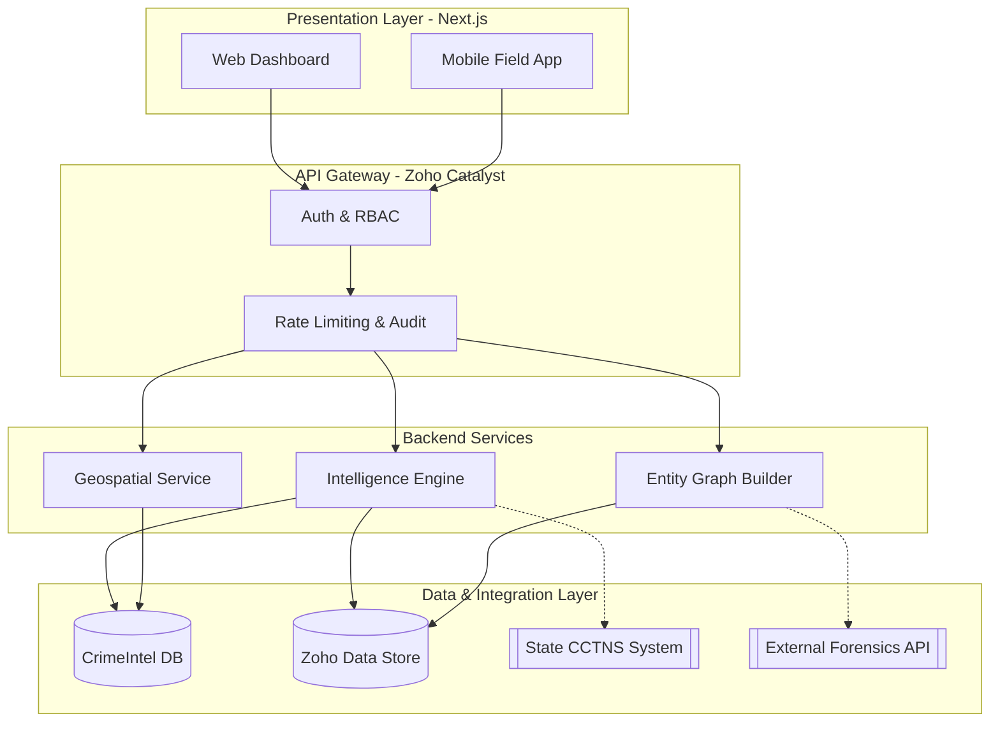
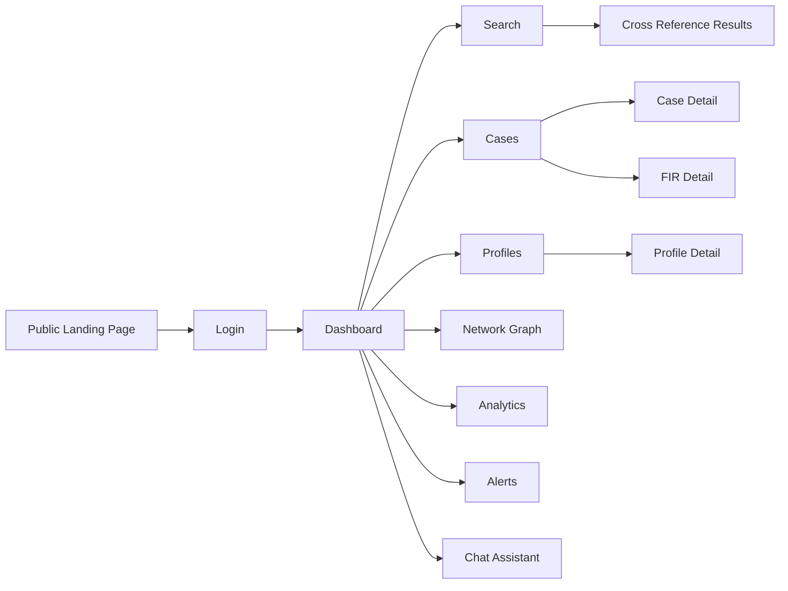
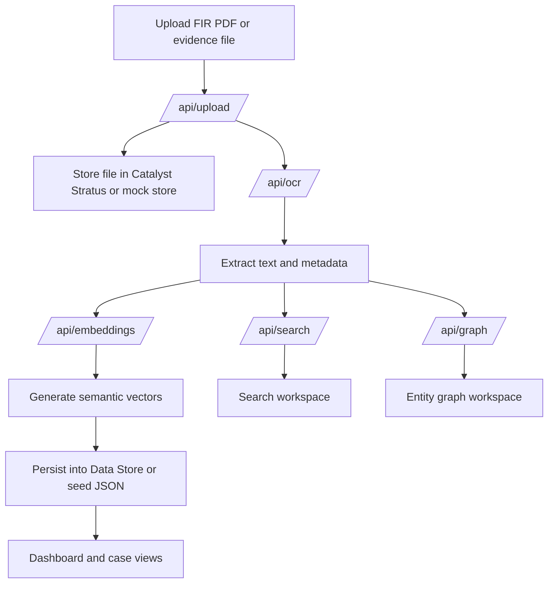
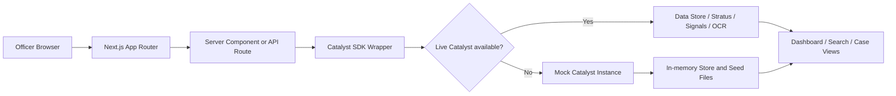

<div align="center">
  
  <h1>CrimeIntel</h1>
  <p><strong>Next-Generation Police Intelligence & Case Management Platform</strong></p>
  <p><em>Built exclusively for Law Enforcement Agencies (LEAs) & Karnataka State Police (KSP)</em></p>
</div>

<br />

<div align="center">
  <a href="https://nextjs.org"></a>
  <a href="https://tailwindcss.com"></a>
  <a href="https://ui.shadcn.com"></a>
  <a href="https://www.zoho.com/catalyst/"></a>
  
</div>

---

## 📖 Overview

**CrimeIntel** is a highly secure, enterprise-grade intelligence dashboard and case management software designed to centralize state policing infrastructure. It acts as an integration layer over existing systems like CCTNS, providing actionable intelligence, suspect tracking, entity-relationship graphing, and predictive real-time heatmaps for superintendents and field officers.

Built with performance and operational security in mind, the system uses modern frontend technologies coupled with a secure backend architecture via Zoho Catalyst.

---

## ✨ Core Features

- **Central Intelligence Dashboard**: Real-time monitoring for officers. Track active investigations, high-risk alerts, and jurisdiction statistics on a single pane of glass.
- **Criminal Network Graphing**: Identify hidden links between suspects, vehicles, properties, and known criminal syndicates using advanced entity-relationship modeling.
- **Real-Time Crime Heatmaps**: Geospatial mapping of recent FIRs and incident reports to predict and prevent future crime spikes.
- **Facial Recognition & Profiling**: Automated suspect matching against state databases, complete with confidence scores and criminal history dossiers.
- **Live Unit Dispatch (CAD)**: Track active response units, active calls, and resource allocation in real-time.

---

## 📸 Screenshots

| Intelligence Graph | Case File UI |
| :---: | :---: |
|  |  |
| **Real-time Heatmap** | **Live CAD Dispatch** |
|  |  |

---

## 🏗️ System Architecture

CrimeIntel employs a decoupled, modular architecture designed for high availability and strict CJIS/enterprise compliance. 



### Technology Stack

#### 🖥️ Frontend
- **Framework**: Next.js 15 (App Router, Server Components)
- **Styling**: Tailwind CSS, Framer Motion
- **UI Components**: Shadcn UI (Radix UI primitives)
- **Data Visualization**: Recharts (for dashboards), specialized graph libraries.
- **State Management**: Zustand (for localized global state), React Server Components.

#### ⚙️ Backend & Infrastructure
- **Serverless Compute**: Zoho Catalyst Functions (Node.js/Java)
- **Database**: Zoho Catalyst Relational Data Store / PostgreSQL
- **Caching**: Zoho Catalyst Cache (Redis-backed)
- **Authentication**: Zoho Catalyst Auth (with strict RBAC for Officer / Admin roles)

---

## 🔐 Security & Compliance

Given the highly sensitive nature of law enforcement data, CrimeIntel implements zero-trust architecture principles:

1. **AES-256 Encryption**: All data is encrypted at rest and in transit (TLS 1.3).
2. **Strict Audit Logging**: Every query, export, and search is immutably logged to an audit trail.
3. **Role-Based Access Control (RBAC)**: Fine-grained permissions restrict data access based on rank and jurisdiction.
4. **CJIS Compatibility**: Infrastructure designed to be deployed on government-approved sovereign cloud instances or strictly on-premise.

---

## 🚀 Development Setup

Follow these steps to run the CrimeIntel frontend locally.

### Prerequisites
- Node.js 18.x or higher
- npm or pnpm
- Zoho Catalyst CLI if you want to connect to live Catalyst services
- Git

### Recommended workspace path
The application code lives in `crimeintel/`, so most local commands should be run from that directory.

### 1. Clone the repository
```bash
git clone https://github.com/karthik5033/CrimeIntel.git
cd CrimeIntel/crimeintel
```

### 2. Install dependencies
```bash
npm install
```

### 3. Setup environment variables
Copy the example environment file and configure your credentials:
```bash
cp .env.local.example .env.local
```

#### Required Environment Variables

Edit `.env.local` with your actual configuration:

```env
# Catalyst Project Configuration
CATALYST_PROJECT_ID=55949000000013025
CATALYST_ENV=Development

# Authentication Mode
USE_MOCK_CATALYST=true  # Set to 'false' for production

# OAuth 2.0 Credentials (Required for production)
CATALYST_CLIENT_ID=<your_client_id_here>
CATALYST_CLIENT_SECRET=<your_client_secret_here>
CATALYST_REFRESH_TOKEN=<your_refresh_token_here>
CATALYST_ORG_ID=60078981781

# QuickML Configuration
QUICKML_ENDPOINT_KEY=https://api.catalyst.zoho.in/quickml/v1/project/55949000000013025/glm/chat
```

#### OAuth Setup Guide

CrimeIntel uses OAuth 2.0 for secure authentication with Zoho Catalyst services. You have two options:

##### Method 1: Catalyst CLI (Recommended for Development)

The easiest way to authenticate during local development:

```bash
# Install Catalyst CLI globally
npm install -g zcatalyst-cli

# Authenticate (opens browser for login)
catalyst login

# The CLI creates a .catalystrc file that the SDK uses automatically
```

Once authenticated, set `USE_MOCK_CATALYST=false` in `.env.local` to use real Catalyst services.

##### Method 2: Manual OAuth (Required for Production)

For production deployments or CI/CD pipelines, you need to generate OAuth credentials manually:

**Step 1: Create a Zoho API Console Self Client**

1. Visit [Zoho API Console](https://api-console.zoho.in/)
2. Click "Add Client" → "Self Client"
3. Note your **Client ID** and **Client Secret**

**Step 2: Generate Authorization Code**

Visit this URL in your browser (replace `YOUR_CLIENT_ID` with your actual client ID):

```
https://accounts.zoho.in/oauth/v2/auth?scope=ZohoCatalyst.projects.ALL,ZohoCatalyst.filestore.CREATE,ZohoCatalyst.datastore.CREATE,QuickML.deployment.READ&client_id=YOUR_CLIENT_ID&response_type=code&access_type=offline&redirect_uri=http://localhost
```

After authorizing, you'll be redirected to `http://localhost?code=AUTHORIZATION_CODE`. Copy the code parameter.

**Step 3: Exchange Code for Refresh Token**

Use curl or Postman to make this request:

```bash
curl -X POST https://accounts.zoho.in/oauth/v2/token \
  -H "Content-Type: application/x-www-form-urlencoded" \
  -d "client_id=YOUR_CLIENT_ID" \
  -d "client_secret=YOUR_CLIENT_SECRET" \
  -d "code=AUTHORIZATION_CODE_FROM_STEP_2" \
  -d "grant_type=authorization_code" \
  -d "redirect_uri=http://localhost"
```

The response will include a `refresh_token`. This token doesn't expire and can be used to generate access tokens.

**Step 4: Update Environment Variables**

Add the credentials to your `.env.local`:

```env
CATALYST_CLIENT_ID=your_client_id_from_step_1
CATALYST_CLIENT_SECRET=your_client_secret_from_step_1
CATALYST_REFRESH_TOKEN=your_refresh_token_from_step_3
USE_MOCK_CATALYST=false
```

#### Authentication Modes

CrimeIntel supports multiple authentication strategies (tried in order):

1. **Local .catalystrc** - Project-level authentication file
2. **CLI Authentication** - User-level credentials from `catalyst login`
3. **OAuth Refresh Token** - Client ID/Secret + Refresh Token (recommended for production)
4. **Legacy Token** - Direct token authentication (deprecated)

The SDK will try each method until one succeeds. If all fail and `USE_MOCK_CATALYST=false`, the app will throw an error explaining which credentials are needed.

#### Environment Variable Reference

| Variable | Required | Description |
| --- | --- | --- |
| `CATALYST_CLIENT_ID` | Yes (production) | OAuth client ID from Zoho API Console |
| `CATALYST_CLIENT_SECRET` | Yes (production) | OAuth client secret from Zoho API Console |
| `CATALYST_REFRESH_TOKEN` | Yes (production) | Refresh token from OAuth flow |
| `CATALYST_ORG_ID` | Yes | Zoho organization ID (default: 60078981781) |
| `CATALYST_PROJECT_ID` | Yes | Catalyst project ID |
| `CATALYST_ENV` | Yes | Catalyst environment (Development/Production) |
| `USE_MOCK_CATALYST` | No | Set to `true` for mock mode, `false` for production |
| `QUICKML_ENDPOINT_KEY` | Yes | Catalyst GLM endpoint URL |
| `CATALYST_TOKEN` | No | Legacy token authentication (deprecated) |

For more details, see [Zoho Catalyst OAuth Documentation](https://www.zoho.com/catalyst/help/api/oauth/refresh-access-token.html).

#### NoSQL TTL Configuration

CrimeIntel uses Catalyst NoSQL to store chat sessions with automatic expiration after 30 days. To enable Time-To-Live (TTL) for the `ChatSessions` table:

**Manual Configuration (Required for Production):**

1. Log into the [Zoho Catalyst Console](https://console.catalyst.zoho.in/)
2. Navigate to your project → **Data Store** → **NoSQL**
3. Select the `ChatSessions` table
4. Go to **Settings** → **TTL Policy**
5. Enable TTL and configure:
   - **TTL Attribute**: `ttl`
   - **TTL Unit**: Milliseconds (epoch timestamp)
6. Save the configuration

**How It Works:**
- Each session automatically gets a `ttl` field set to 30 days from creation
- On each update, the TTL is refreshed (extends the session lifetime)
- Catalyst automatically deletes sessions after their TTL expires
- No manual cleanup required

**Testing TTL:**
```bash
# Create a test session with 1-minute TTL
curl -X POST http://localhost:3000/api/chat \
  -H "Content-Type: application/json" \
  -d '{"sessionId":"test-ttl","message":"hello"}'

# Wait 1 minute and verify it's deleted
curl -X GET http://localhost:3000/api/chat?sessionId=test-ttl
# Should return empty session template (not existing session)
```

### 4. Start the development server
```bash
npm run dev
```

The application will be available at `http://localhost:3000`.

### 5. Validate the build
```bash
npm run lint
npm run build
```

### Development modes
- Live mode: uses Catalyst credentials and real backend services.
- Mock mode: sets `USE_MOCK_CATALYST=true` and uses in-memory stores for fast UI development.
- Hybrid mode: uses local seed data from `data/seed/` when server-side Catalyst access is unavailable.

### Common local commands
```bash
npm run dev
npm run lint
npm run build
```

### Backend seed function
The repository also includes a Catalyst function at `functions/SeedFunction/` for seeding or bootstrapping backend data when you are working with live Catalyst services.

---

## Product Surface

CrimeIntel is organized around investigation workflows rather than just screens. The main user-facing areas are:

| Area | Purpose |
| --- | --- |
| Dashboard | High-level operational summary, live feed, alerts, and trending signals |
| Cases | Case lists, case detail views, FIR-centric investigation workspaces |
| FIRs | FIR drill-down, document review, and metadata access |
| Profiles | Suspect, witness, and entity profiles with linked records |
| Network | Relationship graphing across people, vehicles, phones, and accounts |
| Analytics | Charts, correlations, anomalies, and summary views |
| Search | Cross-reference and semantic lookup across records |
| Financial | Money flow and account-linked investigation support |
| Alerts | Active alerts and operational notifications |
| Chat | Investigator assistant / reasoning workspace |
| Audit | Query and activity audit trail |
| Data Ingestion | Document upload and intake |
| Admin | Data loader and operational utilities |

### Route map
The app router includes a public landing page and the authenticated workstation:

| Route | Description |
| --- | --- |
| `/` | Public landing page |
| `/login` | Authentication entry point |
| `/dashboard` | Operational dashboard |
| `/search` | Search workspace |
| `/cases` | Case list |
| `/cases/[id]` | Case detail |
| `/profiles` | Profile list |
| `/profiles/[id]` | Profile detail |
| `/firs/[id]` | FIR detail |
| `/network` | Entity graph workspace |
| `/analytics` | Analytics and trends |
| `/financial` | Financial intelligence workspace |
| `/alerts` | Alert center |
| `/chat` | Investigator chat assistant |
| `/audit` | Audit trail viewer |
| `/settings` | User and workspace settings |
| `/data-ingestion` | Document upload and intake |
| `/admin/data-loader` | Administrative data loading |
| `/test-upload` | Upload diagnostics and testing |

---

## Flowcharts

### User journey flow


### FIR intake and enrichment flow


### Runtime request flow


---

## Repository Structure

```text
CrimeIntel/
├── crimeintel/                # Next.js application
│   ├── app/                   # App Router pages, layouts, and API routes
│   ├── components/           # Reusable UI and domain components
│   ├── lib/                  # Catalyst wrappers, data loaders, helpers
│   ├── data/                 # Seed data, schemas, migrations
│   ├── docs/                 # Implementation guides and schema docs
│   ├── functions/            # Zoho Catalyst serverless functions
│   ├── public/               # Images and static assets
│   ├── scripts/              # Maintenance and generation scripts
│   ├── styles/               # Styling support files
│   └── types/                # Shared TypeScript types
├── crime_mock_db/            # CSVs used for mock or offline data work
├── docs/                     # Product and implementation references
└── README.md
```

### Notable code areas
- `app/api/*` contains the server routes for upload, OCR, graph, search, audit, events, embeddings, and seed workflows.
- `lib/catalyst/*` centralizes Catalyst initialization, live-vs-mock fallback logic, and service wrappers.
- `components/dashboard`, `components/network`, `components/chat`, and `components/analytics` hold the main domain UI surfaces.
- `data/seed` and `crime_mock_db/` support local development without a live backend.

---

## API Surface

The backend is organized as Next.js route handlers so the client never talks directly to Catalyst SDK objects.

| Endpoint | Purpose |
| --- | --- |
| `/api/catalyst-status` | Confirms Catalyst initialization and runtime availability |
| `/api/auth/me` | Returns the active authenticated user |
| `/api/upload` | FIR and evidence document upload pipeline |
| `/api/ocr` | OCR extraction endpoint |
| `/api/embeddings` | Semantic embedding generation |
| `/api/search` | Cross-record search |
| `/api/graph` | Entity graph retrieval and assembly |
| `/api/chat` | Investigator assistant chat |
| `/api/reasoning` | Structured reasoning and explanation output |
| `/api/audit` | Audit log access |
| `/api/events` | Operational event feed |
| `/api/data` | Structured data access |
| `/api/extract` | Text extraction and enrichment |
| `/api/seed` | Seed and bootstrap operations |
| `/api/admin/load-data` | Administrative data loader |
| `/api/nosql/chat` | NoSQL-backed chat experiment route |
| `/api/test-bucket` | Storage connectivity test |

---

## Data and Intelligence Pipeline

CrimeIntel is designed so raw documents can be turned into actionable intelligence quickly:

1. A document is uploaded through the data ingestion UI.
2. The file is stored in Catalyst Stratus or the mock file layer.
3. OCR and extraction services turn the document into structured text.
4. Entity extraction and embedding generation produce searchable intelligence artifacts.
5. Data is indexed into the Data Store or local seed store for search, graphing, and dashboard rendering.
6. Analysts consume the enriched output from the dashboard, search, network, and case modules.

---

## Development Notes

- The client-side UI should call route handlers instead of importing Catalyst SDK code directly.
- Server-side helpers should use `getCatalystApp()` so live and mock modes stay aligned.
- If Catalyst credentials are missing, the app falls back to mock data rather than crashing.
- Use the docs in `crimeintel/docs/` for schema details when adjusting FIR, embeddings, or entity storage logic.
- The repository already contains multiple utility scripts for table creation, seed generation, and bulk data fixes.

---

## Troubleshooting

If something looks broken locally, check these first:

| Symptom | Likely cause | Suggested check |
| --- | --- | --- |
| Upload fails | Missing bucket, Catalyst auth issue, or network problem | Open `/api/catalyst-status` and verify `fir_documents` exists |
| Empty dashboards | Mock data not loaded or wrong seed source | Confirm `USE_MOCK_CATALYST` and `data/seed/` contents |
| SDK initialization error | Missing CLI login or invalid env values | Run `catalyst login` or set `CATALYST_TOKEN` |
| Search returns no results | Seed data not loaded yet | Run the seed flow or check the Data Store contents |
| Graph view is sparse | Relationship data missing | Inspect the entity relationship tables and graph route output |

For deeper upload and Catalyst-specific issues, see `crimeintel/UPLOAD_TROUBLESHOOTING.md` and `crimeintel/CATALYST_AUTH_GUIDE.md`.

---

## 📜 Roadmap

- [x] High-fidelity Dashboard & Command Center UI
- [x] Landing Page with specialized police domain copy
- [ ] Connect Authentication to Zoho Catalyst
- [ ] Implement live WebSocket feed for CAD dispatch
- [ ] Build interactive entity-relationship Graph UI
- [ ] Implement CCTNS mock data ingestion pipelines

---

<div align="center">
  <p>Designed and engineered for the <strong>KSP Hackathon 2026</strong>.</p>
</div>
