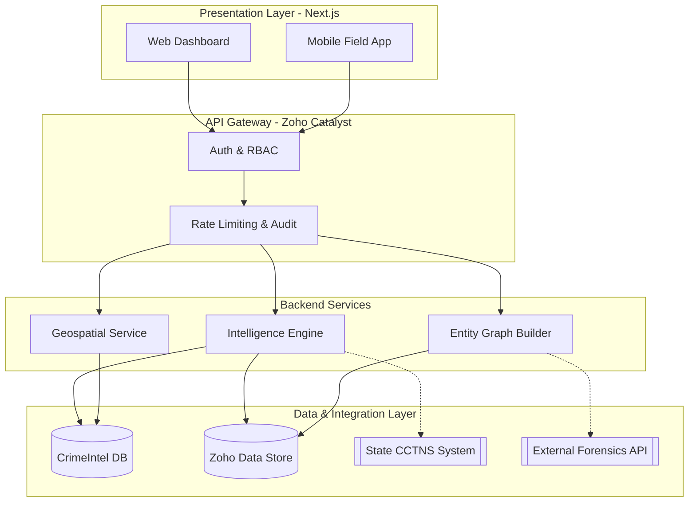

<div align="center">
  
  <h1>CrimeIntel</h1>
  <p><strong>Next-Generation Police Intelligence & Case Management Platform</strong></p>
  <p><em>Built exclusively for Law Enforcement Agencies (LEAs) & Karnataka State Police (KSP)</em></p>
</div>

<br />

<div align="center">
  <a href="https://nextjs.org"></a>
  <a href="https://tailwindcss.com"></a>
  <a href="https://ui.shadcn.com"></a>
  <a href="https://www.zoho.com/catalyst/"></a>
  
</div>

---

## 📖 Overview

**CrimeIntel** is a highly secure, enterprise-grade intelligence dashboard and case management software designed to centralize state policing infrastructure. It acts as an integration layer over existing systems like CCTNS, providing actionable intelligence, suspect tracking, entity-relationship graphing, and predictive real-time heatmaps for superintendents and field officers.

Built with performance and operational security in mind, the system uses modern frontend technologies coupled with a secure backend architecture via Zoho Catalyst.

---

## ✨ Core Features

- **Central Intelligence Dashboard**: Real-time monitoring for officers. Track active investigations, high-risk alerts, and jurisdiction statistics on a single pane of glass.
- **Criminal Network Graphing**: Identify hidden links between suspects, vehicles, properties, and known criminal syndicates using advanced entity-relationship modeling.
- **Real-Time Crime Heatmaps**: Geospatial mapping of recent FIRs and incident reports to predict and prevent future crime spikes.
- **Facial Recognition & Profiling**: Automated suspect matching against state databases, complete with confidence scores and criminal history dossiers.
- **Live Unit Dispatch (CAD)**: Track active response units, active calls, and resource allocation in real-time.

---

## 📸 Screenshots

| Intelligence Graph | Case File UI |
| :---: | :---: |
|  |  |
| **Real-time Heatmap** | **Live CAD Dispatch** |
|  |  |

---

## 🏗️ System Architecture

CrimeIntel employs a decoupled, modular architecture designed for high availability and strict CJIS/enterprise compliance. 



### Technology Stack

#### 🖥️ Frontend
- **Framework**: Next.js 15 (App Router, Server Components)
- **Styling**: Tailwind CSS, Framer Motion
- **UI Components**: Shadcn UI (Radix UI primitives)
- **Data Visualization**: Recharts (for dashboards), specialized graph libraries.
- **State Management**: Zustand (for localized global state), React Server Components.

#### ⚙️ Backend & Infrastructure
- **Serverless Compute**: Zoho Catalyst Functions (Node.js/Java)
- **Database**: Zoho Catalyst Relational Data Store / PostgreSQL
- **Caching**: Zoho Catalyst Cache (Redis-backed)
- **Authentication**: Zoho Catalyst Auth (with strict RBAC for Officer / Admin roles)

---

## 🔐 Security & Compliance

Given the highly sensitive nature of law enforcement data, CrimeIntel implements zero-trust architecture principles:

1. **AES-256 Encryption**: All data is encrypted at rest and in transit (TLS 1.3).
2. **Strict Audit Logging**: Every query, export, and search is immutably logged to an audit trail.
3. **Role-Based Access Control (RBAC)**: Fine-grained permissions restrict data access based on rank and jurisdiction.
4. **CJIS Compatibility**: Infrastructure designed to be deployed on government-approved sovereign cloud instances or strictly on-premise.

---

## 🚀 Development Setup

Follow these steps to run the CrimeIntel frontend locally:

### Prerequisites
- Node.js 18.x or higher
- npm or pnpm
- Zoho Catalyst CLI (for backend deployment)

### 1. Clone the repository
```bash
git clone https://github.com/karthik5033/CrimeIntel.git
cd CrimeIntel/crimeintel
```

### 2. Install dependencies
```bash
npm install
```

### 3. Setup environment variables
Create a `.env.local` file in the root directory:
```env
NEXT_PUBLIC_ZOHO_PROJECT_ID=your_project_id
ZOHO_CATALYST_API_KEY=your_api_key
```

### 4. Start the development server
```bash
npm run dev
```

The application will be available at `http://localhost:3000`.

---

## 📜 Roadmap

- [x] High-fidelity Dashboard & Command Center UI
- [x] Landing Page with specialized police domain copy
- [ ] Connect Authentication to Zoho Catalyst
- [ ] Implement live WebSocket feed for CAD dispatch
- [ ] Build interactive entity-relationship Graph UI
- [ ] Implement CCTNS mock data ingestion pipelines

---

<div align="center">
  <p>Designed and engineered for the <strong>KSP Hackathon 2026</strong>.</p>
</div>
