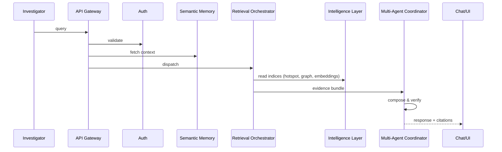

Intelligence-layer architecture (concise)

Sequence (one-query flow)

Key design points
- Precompute and cache indices (hot) and keep durable snapshots (NoSQL)
- Retrieval orchestrator fans out to SQL/Graph/Vector/OCR/Analytics and merges results
- Evidence ranking must tag source retriever and confidence
- Human feedback loop and versioning wrap updates to canonical data

Where to find more
- RULES.md — development rules
- indices.md — index models
- security.md — sensitivity & encryption

(Keep this file short; use implementation_plan for full spec.)