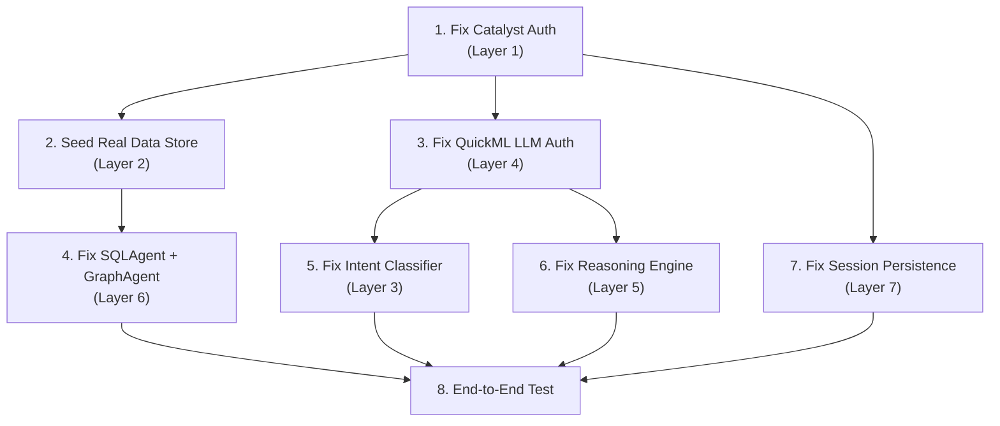

# Chatbot Fix Plan: Real Zoho Catalyst Integration

> The Intelligence Chat is currently non-functional in any meaningful way. Every layer of the pipeline — from Catalyst SDK initialization to LLM response generation — is either hitting mock fallbacks, returning hardcoded strings, or silently failing. This document diagnoses each broken layer and provides a concrete fix using real Zoho Catalyst services.

---

## Current State: What the User Sees

| User Action | Expected Behaviour | Actual Behaviour |
|---|---|---|
| Says "hello" | Conversational greeting from LLM | Hardcoded `"Hello Officer..."` string from mock fallback |
| Says "what can you do?" | LLM-generated capabilities overview | `"I'm sorry, I couldn't find any specific intelligence..."` + QuickML unavailable warning |
| Says "find murder relations" | LLM-summarized intelligence with linked FIRs | Raw ZCQL table dump, heuristic summary, confidence always 30%, reasoning always empty |
| Any query | Investigative Reasoning block populated | Always shows: `Claim: "Analysis complete"`, `Confidence: Low 30%`, `Mechanism: (empty)`, `Evidence: (empty)` |

**Root Cause Chain:**
```
Catalyst SDK init fails → falls back to mock instance
  → Mock ZCQL returns seed JSON data (works partially)
  → QuickML.generateResponse() → CatalystQuickML calls mock quickml.predict()
    → No GROQ_API_KEY set → falls to pure local mock
      → Returns hardcoded template strings
  → ReasoningEngine.processQuery() → requires real Catalyst SDK for LLM Serving
    → Catalyst init fails → fallbackReasoning() always returns Low/30%
```

---

## Architecture Diagnosis: 7 Broken Layers

### Layer 1: Catalyst SDK Authentication (ROOT CAUSE)

**File:** [`index.ts`](file:///d:/coding_files/Projects/CrimeIntel/crimeintel/lib/catalyst/index.ts)

**Problem:** The SDK initialization tries 4 strategies in order:
1. Local `.catalystrc` → Not present in `crimeintel/` directory
2. CLI auth (`~/.zcatalyst/`) → User hasn't run `catalyst login`
3. Client ID/Secret (`CATALYST_CLIENT_ID` / `CATALYST_CLIENT_SECRET`) → Not set in `.env.local`
4. Token-based (`CATALYST_TOKEN`) → Not set in `.env.local`

All 4 fail → line 148 catches and falls back to `createMockCatalystInstance()`. **Every downstream service inherits this mock**.

**Current `.env.local`:**
```
NEXT_PUBLIC_CATALYST_PROJECT_ID=55949000000013025
CATALYST_PROJECT_ID=55949000000013025
USE_MOCK_CATALYST=false          ← says don't mock, but SDK init fails anyway
QUICKML_ENDPOINT_KEY=https://api.catalyst.zoho.in/quickml/v1/project/55949000000013025/glm/chat
```

**Missing variables:**
```
CATALYST_CLIENT_ID=               ← Required for OAuth
CATALYST_CLIENT_SECRET=           ← Required for OAuth
CATALYST_ORG_ID=60078981781       ← Hardcoded in quickml.ts, should be env var
GROQ_API_KEY=                     ← Used by mock as fallback LLM (not even set)
```

**Fix Plan:**

| Step | Action |
|---|---|
| 1a | Run `catalyst login` in the `crimeintel/` directory (interactive browser auth). This creates a `.catalystrc` file that the SDK can pick up on Strategy 1. |
| 1b | **OR** create a Zoho API Console Self-Client, generate `CATALYST_CLIENT_ID` and `CATALYST_CLIENT_SECRET`, add them to `.env.local`. |
| 1c | Add `CATALYST_ORG_ID` to `.env.local` (currently hardcoded as `60078981781` in [`quickml.ts:36`](file:///d:/coding_files/Projects/CrimeIntel/crimeintel/lib/catalyst/quickml.ts#L36) and [`engine.ts:30`](file:///d:/coding_files/Projects/CrimeIntel/crimeintel/lib/reasoning/engine.ts#L30)). |
| 1d | Update `getCatalystApp()` to throw a clear startup error instead of silently falling back to mock when `USE_MOCK_CATALYST` is `false`. Currently the catch block on line 148 ignores the `USE_MOCK_CATALYST=false` flag and mocks anyway. |

---

### Layer 2: Database Connection (ZCQL → Catalyst Data Store)

**File:** [`datastore.ts`](file:///d:/coding_files/Projects/CrimeIntel/crimeintel/lib/catalyst/datastore.ts)

**Problem:** The `CatalystDataStore` methods (e.g., `getFIRs()`, `getPersons()`) call `app.zcql().executeZCQLQuery()`. Because Layer 1 returns a mock app, this executes against an **in-memory Map** loaded from seed JSON files, not the real Catalyst Data Store cloud database.

**What works:** The seed data files exist (`data/seed/FIRs.json`, etc.), so mock ZCQL returns data. This is why the user sees a data table with murder FIRs — it's real seed data, just served from memory, not Catalyst.

**What's broken:**
- No data persistence between server restarts
- No real ZCQL query parsing (the mock regex on line 316 only handles basic `SELECT * FROM X WHERE field = 'val'`)
- Mock can't handle complex queries like JOINs, GROUP BY, COUNT, sub-queries
- `WHERE` clause matching is loose — falls back to returning generic rows when no match (line 383)

**Fix Plan:**

| Step | Action |
|---|---|
| 2a | Once Layer 1 auth is fixed, verify tables exist in Catalyst Data Store console: `FIRs`, `Persons`, `Vehicles`, `EntityRelationships`, `PhoneRecords`, `BankAccounts`, `Weapons`, `Cases`, `SocioEconomicData`, `Transactions` |
| 2b | Seed the real Catalyst Data Store using the existing `insertFIRs()`, `insertPersons()` etc. methods with the JSON seed data. Create a one-time `/api/admin/seed` route that loads `data/seed/*.json` and calls the insert methods against the REAL Catalyst SDK. |
| 2c | Add **parameterised ZCQL queries** to `datastore.ts` to avoid SQL injection via string interpolation. Current code on line 30: `` `SELECT * FROM Persons WHERE ROWID = '${id}'` `` is injectable. Use Catalyst's parameterised query API. |
| 2d | Add a `Districts` table in Catalyst Data Store if not present (the mock creates it from `Districts.json` seed). This table is critical for the map API and chat context resolution. |

---

### Layer 3: Intent Classification (Heuristic Fallback)

**File:** [`intentClassifier.ts`](file:///d:/coding_files/Projects/CrimeIntel/crimeintel/lib/ai/chat/intentClassifier.ts)

**Problem:** `IntentClassifier.classify()` sends a classification prompt to `CatalystQuickML.generateResponse()`. Since QuickML fails (Layer 4), it catches the error on line 82 and falls to `basicHeuristicClassification()`. The heuristic works **okay** for obvious keywords ("murder" → `DIRECT_RETRIEVAL`) but fails for:
- Natural language queries ("can you help me find murder relations" → matches `RELATIONSHIP_QUERY` on "relation" but also `DIRECT_RETRIEVAL` on keyword order)
- Ambiguous queries ("what can you do?" → `CONVERSATIONAL`, correct, but no RAG data = empty + unhelpful fallback text)
- Follow-up queries ("what about last year?" → `FOLLOW_UP` but context is always empty because NoSQL session persistence is mocked)

**Fix Plan:**

| Step | Action |
|---|---|
| 3a | Fix Layer 4 (QuickML) so the LLM-based classifier works. The prompt on line 30-61 is well-structured and will produce good intent classification once the LLM responds. |
| 3b | **Improve heuristic fallback** to handle multi-keyword conflict. Currently, the regex checks execute in a fixed if-else chain. "find murder relations" hits the `RELATIONSHIP_QUERY` regex (`/relation/`) before `DIRECT_RETRIEVAL` (`/find/`). Add a **scoring system**: assign each matched regex a weight, pick the intent with the highest aggregate score. |
| 3c | Add crime type synonyms to `CRIME_TYPE_MAPPINGS` for Kannada transliterations (e.g., `kole` → Murder, `kalla` → Theft) so the heuristic works for bilingual queries even before translation. |
| 3d | Fix the entity extraction to handle "murder relations" as `crime_type: Murder` + `intent: RELATIONSHIP_QUERY` (currently it breaks on the first match and sets intent to `DIRECT_RETRIEVAL` on line 127). |

---

### Layer 4: Catalyst QuickML / LLM Response Generation (CRITICAL)

**File:** [`quickml.ts`](file:///d:/coding_files/Projects/CrimeIntel/crimeintel/lib/catalyst/quickml.ts)

**Problem:** This is the LLM backbone. `generateResponse()` tries:

1. **Direct LLM Serving API** (line 21): if `QUICKML_ENDPOINT_KEY` starts with `http`, it calls the Catalyst GLM endpoint directly. The env var IS set to `https://api.catalyst.zoho.in/quickml/v1/project/55949000000013025/glm/chat`, so this path executes. BUT:
   - Line 26-31: Tries `app.credential.getToken()` to get a Bearer token — fails because `app` is the mock instance (no `.credential`).
   - Line 36: Falls back to sending `CATALYST-ORG: 60078981781` header without auth → Catalyst rejects with 401.
   - Line 58: Catches the error, falls through to...

2. **QuickML Pipeline** (line 64): Checks `quickml.predict()` — the mock version checks for `GROQ_API_KEY` (not set), then returns a local hardcoded template (the "Hello Officer" / "Based on my analysis" strings).

**Why the user sees what they see:**
```
"hello"        → Mock predict() → line 112: regex /hello|hi|hey/ → "Hello Officer..."
"what can you" → Mock predict() → totalRecords = 0 → "I've scanned the databases..."
"find murder"  → Mock predict() → totalRecords > 0 → "I found X incident records..."
                                    ↑ Heuristic summary, not real LLM generation
```

The `*(Note: Catalyst QuickML is currently unconfigured...)*` message visible in the screenshot comes from line 106 of the **heuristic fallback** in `quickml.ts`.

**Fix Plan:**

| Step | Action |
|---|---|
| 4a | **Fix authentication for LLM Serving API.** The endpoint `https://api.catalyst.zoho.in/quickml/v1/project/.../glm/chat` requires a valid Zoho OAuth token. Use the same `getAccessToken()` from [`direct-api.ts`](file:///d:/coding_files/Projects/CrimeIntel/crimeintel/lib/catalyst/direct-api.ts) (which already implements `client_credentials` OAuth against `accounts.zoho.in`). Wire `quickml.ts` to use this shared OAuth function instead of trying `app.credential.getToken()`. |
| 4b | **Set the correct `CATALYST-ORG` header.** Verify the org ID `60078981781` matches the actual Zoho Catalyst organization. Extract to `CATALYST_ORG_ID` env var. |
| 4c | **Fix the system prompt.** Line 47 sends a generic `"You are an AI intelligence assistant."` system prompt. Replace with a domain-specific CrimeIntel prompt that instructs the LLM to summarize FIR data, identify patterns, and respond as a Karnataka State Police intelligence assistant. |
| 4d | **Fix context serialization.** Line 48 sends the full `contextData` (including `ragContext` with all evidence arrays) as a raw `JSON.stringify()` blob appended to the user message. This can exceed token limits for large evidence sets. Instead, summarize the RAG context before sending — extract only key fields (FIR number, crime type, district, date, status, description) and cap at ~15 records. |
| 4e | **Add a working intermediate fallback.** If Catalyst LLM Serving is unavailable, fall back to Groq API (which the mock already supports but `GROQ_API_KEY` is not set). Add `GROQ_API_KEY` to `.env.local` as a backup LLM. The mock's Groq integration on line 517 is actually well-written. |
| 4f | **Remove the mock predict() entirely from production flow.** When `USE_MOCK_CATALYST=false`, `quickml.ts` should never reach the mock's `predict()` method. Currently it does because `getCatalystApp()` silently falls back to mock. |

---

### Layer 5: Reasoning Engine (Always Returns Fallback)

**File:** [`engine.ts`](file:///d:/coding_files/Projects/CrimeIntel/crimeintel/lib/reasoning/engine.ts)

**Problem:** `ReasoningEngine.processQuery()` on line 12 checks `process.env.QUICKML_ENDPOINT_KEY`. It IS set, so it proceeds. But line 21 does `require('zcatalyst-sdk-node').initialize()` — a **direct, independent** SDK init that does NOT go through `getCatalystApp()`. This fails because there's no `.catalystrc` or OAuth config available at `require('zcatalyst-sdk-node').initialize()` level.

The catch on line 112 falls to `fallbackReasoning()` which returns:
```json
{
  "claim": "Analysis complete based on provided context.",
  "confidence": { "level": "Low", "score": 30 },
  "mechanisms": [],
  "evidence": [],
  "alternatives": []
}
```

This is exactly what the user sees in the Investigative Reasoning panel — an empty shell with 30% confidence.

**Fix Plan:**

| Step | Action |
|---|---|
| 5a | **Replace the independent SDK init** on line 21 (`require('zcatalyst-sdk-node').initialize()`) with `getCatalystApp()` from the shared module. This ensures the engine uses the same authenticated Catalyst instance as everything else. |
| 5b | **Use the shared OAuth flow** for the LLM Serving API call. The engine makes its own `fetch()` to the `QUICKML_ENDPOINT_KEY` endpoint (line 79). Reuse the `getAccessToken()` from `direct-api.ts` instead of trying to extract a token from the SDK. |
| 5c | **Fix the model name.** Line 83: `model: "crm-di-glm47b_30b_it"` — verify this model ID exists in the Catalyst QuickML console. If not, use the default GLM endpoint (which doesn't need a model parameter, it's baked into the endpoint URL). |
| 5d | **Fix the system prompt.** The reasoning prompt (line 36-75) asks the LLM to output raw JSON. This is fragile. Add JSON mode enforcement: include `response_format: { type: "json_object" }` in the request body if the GLM endpoint supports it. Add fallback JSON extraction if the LLM wraps response in markdown. |
| 5e | **Persist reasoning outputs.** Line 108 calls `CatalystNoSQL.saveReasoningOutput()` — this currently goes to the mock NoSQL (which is a no-op). Once Layer 1 auth is fixed, this will persist reasoning traces to Catalyst NoSQL for audit. Verify the `ReasoningOutputs` NoSQL table exists in the Catalyst console. |

---

### Layer 6: Multi-Agent Evidence Retrieval

**File:** [`coordinator.ts`](file:///d:/coding_files/Projects/CrimeIntel/crimeintel/lib/ai/agents/coordinator.ts)

**Problem:** The coordinator dispatches to 5 agents. Each one works against the mock data, which partially works but has issues:

| Agent | File | Status | Issue |
|---|---|---|---|
| `SQLAgent` | [`sqlAgent.ts`](file:///d:/coding_files/Projects/CrimeIntel/crimeintel/lib/ai/agents/sqlAgent.ts) | ⚠️ Partial | Constructs ZCQL queries that the mock can parse (basic `WHERE` clauses). Returns seed FIR data. **BUT**: district mapping is hardcoded (line 18-27), SQL injection risk via string interpolation, and local re-filtering needed because mock ZCQL is unreliable. |
| `GraphAgent` | [`graphAgent.ts`](file:///d:/coding_files/Projects/CrimeIntel/crimeintel/lib/ai/agents/graphAgent.ts) | ⚠️ Partial | Fetches ALL `EntityRelationships` then filters client-side. Works with mock data but won't scale. For "murder relations" query, it looks for person names in entity IDs — but the heuristic classifier extracts names using a capitalization regex that won't catch "murder" as a crime type link. |
| `VectorAgent` | [`vectorAgent.ts`](file:///d:/coding_files/Projects/CrimeIntel/crimeintel/lib/ai/agents/vectorAgent.ts) | ❌ Broken | Calls `performSemanticSearch()` which needs real embeddings and a vector index. With the mock, embeddings return `[0.1, 0.1, ...]` (line 624 of index.ts) — cosine similarity is meaningless. The semantic matches shown in the UI ("Attempt to Murder, 47% Match") come from this agent but are random/incorrect. |
| `AnalyticsAgent` | [`analyticsAgent.ts`](file:///d:/coding_files/Projects/CrimeIntel/crimeintel/lib/ai/agents/analyticsAgent.ts) | ⚠️ Partial | Runs aggregate queries on the mock. Basic counting works but advanced analytics (hotspot detection, time-series) are placeholder. |
| `FinancialAgent` | [`financialAgent.ts`](file:///d:/coding_files/Projects/CrimeIntel/crimeintel/lib/ai/agents/financialAgent.ts) | ⚠️ Partial | Has real ZCQL queries for `Transactions` and `BankAccounts` tables. Works against mock data. |

**Fix Plan:**

| Step | Action |
|---|---|
| 6a | **SQLAgent**: Remove hardcoded district mapping. Query the `Districts` table from Catalyst Data Store to build the mapping dynamically. Add parameterised queries. |
| 6b | **GraphAgent**: Instead of fetching ALL relationships and filtering client-side, use a WHERE clause: `SELECT * FROM EntityRelationships WHERE source LIKE '%entityName%' OR target LIKE '%entityName%'`. The real ZCQL engine supports this. |
| 6c | **VectorAgent**: This needs Catalyst QuickML embeddings to be functional. Once Layer 4 is fixed, `CatalystQuickML.generateEmbedding()` will return real 768-dim vectors. Then the semantic search needs a proper vector index (either in Catalyst or a local HNSW). **Short-term fix**: disable VectorAgent and rely on SQLAgent + GraphAgent for retrieval. Remove the fake similarity scores from the UI. |
| 6d | **AnalyticsAgent**: Add real aggregate ZCQL: `SELECT district_id, COUNT(*) as count FROM FIRs GROUP BY district_id`. Catalyst ZCQL supports GROUP BY. |

---

### Layer 7: Session Context & Persistence

**File:** [`contextManager.ts`](file:///d:/coding_files/Projects/CrimeIntel/crimeintel/lib/ai/chat/contextManager.ts) + [`nosql.ts`](file:///d:/coding_files/Projects/CrimeIntel/crimeintel/lib/catalyst/nosql.ts)

**Problem:** `ContextManager.getSession()` calls `CatalystNoSQL.getChatSession()` which calls `app.nosql().table('ChatSessions').fetchItem()`. With the mock, `fetchItem()` always returns `[]` (line 647 of index.ts). So every request starts with a **blank session** — no conversation memory, no entity carry-over, no follow-up support.

This means:
- The "Active Context" sidebar is always empty
- Follow-up queries like "what about last year?" have no context to resolve against
- Entity accumulation across turns doesn't persist

**Fix Plan:**

| Step | Action |
|---|---|
| 7a | Once Layer 1 is fixed, ensure the `ChatSessions` NoSQL table exists in Catalyst console. Schema: partition key = `session_id`, sort key = `updated_at`, attributes: `data` (JSON string), `user_id`. |
| 7b | Verify `saveChatSession()` actually upserts (not just inserts). Currently line 189 uses `insertItems` which may fail on duplicate keys. Use `updateItems` or catch the duplicate key error and update instead. |
| 7c | Add a TTL policy to `ChatSessions` so old sessions are automatically cleaned up (e.g., 30 days). Catalyst NoSQL supports TTL on items. |

---

## Execution Order (Critical Path)



**Phase 1 (Auth + Data) — Must be done first:**
- [ ] Layer 1: Authenticate Catalyst SDK (either `catalyst login` or Client ID/Secret)
- [ ] Layer 2: Seed Catalyst Data Store with real data

**Phase 2 (LLM Pipeline) — Unlocks intelligent responses:**
- [ ] Layer 4: Fix QuickML/GLM auth so LLM generates real natural language responses
- [ ] Layer 5: Fix Reasoning Engine to produce real investigative reasoning

**Phase 3 (Intelligence Quality) — Improves retrieval accuracy:**
- [ ] Layer 3: Improve intent classification with scoring + LLM-backed classifier
- [ ] Layer 6: Fix multi-agent retrieval (especially SQLAgent parameterised queries, disable VectorAgent)

**Phase 4 (UX) — Enables conversation flow:**
- [ ] Layer 7: Fix session persistence in NoSQL for context carry-over

---

## New/Modified Environment Variables

| Variable | Required | Purpose |
|---|---|---|
| `CATALYST_CLIENT_ID` | ✅ Yes | OAuth client ID for Catalyst API authentication |
| `CATALYST_CLIENT_SECRET` | ✅ Yes | OAuth client secret for Catalyst API authentication |
| `CATALYST_ORG_ID` | ✅ Yes | Zoho organization ID (currently hardcoded as `60078981781`) |
| `CATALYST_PROJECT_ID` | Already set | Catalyst project ID |
| `QUICKML_ENDPOINT_KEY` | Already set | Catalyst GLM chat endpoint URL |
| `GROQ_API_KEY` | Recommended | Fallback LLM if Catalyst GLM is unavailable (free tier available) |
| `QUICKML_EMBEDDING_ENDPOINT_KEY` | Optional | Separate endpoint for embedding generation (for VectorAgent) |

---

## Files to Modify

| File | Change Summary |
|---|---|
| [`.env.local`](file:///d:/coding_files/Projects/CrimeIntel/crimeintel/.env.local) | Add `CATALYST_CLIENT_ID`, `CATALYST_CLIENT_SECRET`, `CATALYST_ORG_ID`, `GROQ_API_KEY` |
| [`lib/catalyst/index.ts`](file:///d:/coding_files/Projects/CrimeIntel/crimeintel/lib/catalyst/index.ts) | Respect `USE_MOCK_CATALYST=false` — throw instead of silent mock fallback |
| [`lib/catalyst/quickml.ts`](file:///d:/coding_files/Projects/CrimeIntel/crimeintel/lib/catalyst/quickml.ts) | Use shared OAuth from `direct-api.ts`; improve system prompt; cap RAG context size |
| [`lib/catalyst/direct-api.ts`](file:///d:/coding_files/Projects/CrimeIntel/crimeintel/lib/catalyst/direct-api.ts) | Export `getAccessToken()` for reuse by `quickml.ts` and `engine.ts` |
| [`lib/reasoning/engine.ts`](file:///d:/coding_files/Projects/CrimeIntel/crimeintel/lib/reasoning/engine.ts) | Replace standalone `require('zcatalyst-sdk-node').initialize()` with shared `getCatalystApp()`; use shared OAuth for LLM calls |
| [`lib/ai/chat/intentClassifier.ts`](file:///d:/coding_files/Projects/CrimeIntel/crimeintel/lib/ai/chat/intentClassifier.ts) | Add scoring-based intent resolution; expand crime type mappings |
| [`lib/ai/agents/sqlAgent.ts`](file:///d:/coding_files/Projects/CrimeIntel/crimeintel/lib/ai/agents/sqlAgent.ts) | Dynamic district mapping from DB; parameterised ZCQL |
| [`lib/ai/agents/graphAgent.ts`](file:///d:/coding_files/Projects/CrimeIntel/crimeintel/lib/ai/agents/graphAgent.ts) | Server-side WHERE filtering instead of fetching all rows |
| [`lib/ai/agents/vectorAgent.ts`](file:///d:/coding_files/Projects/CrimeIntel/crimeintel/lib/ai/agents/vectorAgent.ts) | Disable until real embeddings available; remove fake similarity scores |
| [`lib/catalyst/nosql.ts`](file:///d:/coding_files/Projects/CrimeIntel/crimeintel/lib/catalyst/nosql.ts) | Fix `saveChatSession()` to upsert instead of insert-only |
| [`app/api/chat/route.ts`](file:///d:/coding_files/Projects/CrimeIntel/crimeintel/app/api/chat/route.ts) | No structural changes needed — the route is well-architected. Fixes cascade from layers below. |
| **[NEW]** `app/api/admin/seed/route.ts` | One-time data seeding endpoint to load `data/seed/*.json` into real Catalyst Data Store |

---

## Zoho Catalyst Services Used

| Service | Purpose | Current Status | After Fix |
|---|---|---|---|
| **Data Store** (ZCQL) | Structured queries on FIRs, Persons, Vehicles, Relationships | ❌ Mock in-memory Map | ✅ Real Catalyst SQL database |
| **NoSQL** | Chat session persistence, reasoning output audit trail, document metadata | ❌ Mock (returns `[]`) | ✅ Real Catalyst NoSQL with TTL |
| **QuickML / GLM** | LLM-based intent classification, response generation, reasoning | ❌ Hardcoded templates | ✅ Real Catalyst GLM 47B model |
| **QuickML Embeddings** | Semantic vector search for FIR narratives | ❌ Returns `[0.1, ...]` | 🔶 Phase 2 (needs embedding endpoint) |
| **Stratus (File Store)** | FIR document uploads, OCR source files | ⚠️ Mock file storage | ✅ Real Catalyst file storage (already partially works via `direct-api.ts`) |
| **Signals** | Real-time event streaming (Live Event Feed) | ❌ Not connected | 🔶 Phase 3 (separate from chatbot) |

---

## Expected Result After Fix

| User Action | New Behaviour |
|---|---|
| Says "hello" | GLM responds with natural language greeting, aware of its capabilities |
| Says "find murder cases in Mysuru" | Intent: `DIRECT_RETRIEVAL`, SQLAgent queries real Data Store, GLM summarizes FIR records with district context |
| Says "how are they related?" | Intent: `FOLLOW_UP`, context carries forward Mysuru + Murder, GraphAgent fetches real entity relationships, GLM explains connections |
| Investigative Reasoning panel | Real claim, mechanisms from criminological theories, evidence linked to actual FIR IDs, confidence derived from data quality |
| Semantic Matches | Real embedding-based similarity scores (or disabled until embeddings work) |
